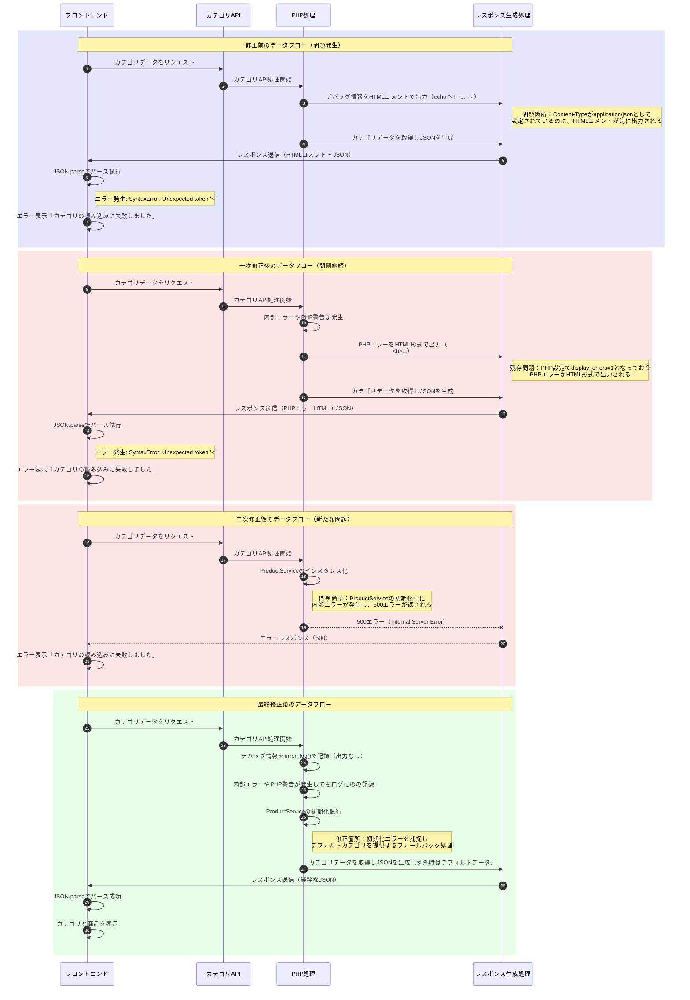

# 変更・修正履歴

## ファイル記入ルール

このファイルは、システムに対して行われた変更や修正を記録するためのものです。以下のルールに従って記載してください：

1. **新しい課題や問題**：
   - トピックごとに見出しを作成し、日付とタイトルを記載
   - 問題内容、エラー詳細、影響範囲を記述
   - 原因と解決案を記載
   - 実施予定のタスクをチェックリスト形式で記載

2. **修正実施報告**：
   - 実施内容に「修正実施報告(N)」という見出しを付け、具体的な変更内容を記述
   - 変更前/変更後のコードを記載
   - 動作確認結果を記載
   - 完了したタスクにはチェックマーク（[x]）を付ける

3. **形式**：
   - マークダウン形式で記載
   - コードブロックは言語を指定（例：```php）
   - 日付形式は YYYY-MM-DD 形式で統一

---

## 2024-09-30 - APIレスポンスのデバッグHTMLコメント問題（解決済み：2024-10-03）

### 問題内容
フロントエンドアプリがJSONを期待するAPIリクエストに対して、HTMLコメントが混入したレスポンスが返されるため、JSON解析エラーが発生しています。

#### エラー詳細
Chromeコンソールに以下のエラーメッセージが表示されています：
```
API /products/categories.php エラー: SyntaxError: Unexpected token '<', "<!-- デバッグ情"... is not valid JSON
```

#### 影響範囲
- LINEログイン後、カテゴリと商品の読み込みに失敗し、アプリの主要機能が使用不可能になる
- フロントエンドの画面に「エラーが発生しました。商品カテゴリの読み込みに失敗しました」というメッセージが表示される

### 原因
`/api/v1/products/categories.php` ファイルの先頭部分で、JSONレスポンスを返す前にHTMLコメント形式のデバッグ情報が出力されています。

```php
// デバッグ情報の出力
echo "<!-- デバッグ情報: \n";
echo "現在のディレクトリ: " . $currentDir . "\n";
echo "現在のフルパス: " . $currentRealPath . "\n";
echo "ルートパス: " . $rootPath . "\n";
echo "ログファイルパス: " . $rootPath . '/logs/CategoryAPI.log' . "\n";
echo "-->";
```

また、ログディレクトリの確認時にも同様のHTMLコメントが出力されています：
```php
// ログディレクトリのパーミッションをチェック
$dirWritable = is_writable($logDir);
echo "<!-- ログディレクトリの書き込み権限: " . ($dirWritable ? "あり" : "なし") . " -->";
```

APIからのレスポンスはJSONであるべきですが、これらのHTMLコメントが最初に出力されるため、クライアント側のJSON解析が失敗しています。

### 解決案

#### 即時解決方法（推奨）
開発時のデバッグ用コードを削除するか、条件付きで実行するように修正します：

1. `/api/v1/products/categories.php` ファイルを編集し、すべての `echo "<!--"` から始まるHTMLコメント出力を削除する
2. または、デバッグモードフラグに基づいて条件付きで出力するように修正：

```php
// デバッグ情報の出力（デバッグモード時のみ）
if (defined('DEBUG_MODE') && DEBUG_MODE && !headers_sent()) {
    // ヘッダーがまだ送信されていない場合のみ、テキストログとして出力
    error_log("デバッグ情報：現在のディレクトリ: " . $currentDir);
    error_log("デバッグ情報：現在のフルパス: " . $currentRealPath);
    error_log("デバッグ情報：ルートパス: " . $rootPath);
    error_log("デバッグ情報：ログファイルパス: " . $rootPath . '/logs/CategoryAPI.log');
}
```

#### 中長期的な改善案
1. APIエンドポイント全体でのデバッグ情報出力方法の標準化：
   - JSONレスポンスのheaderを設定する前にデバッグ出力を行わない
   - デバッグ情報はファイルログかシステムログに記録し、API応答に混入させない
   - 開発環境と本番環境でのデバッグ設定を明確に分離する

2. `ResponseFormatter` クラスなどを作成して、一貫したAPI応答を生成：
   ```php
   class ResponseFormatter {
       public static function success($data, $message = '') {
           header('Content-Type: application/json; charset=UTF-8');
           echo json_encode([
               'success' => true,
               'data' => $data,
               'message' => $message,
               'timestamp' => date('Y-m-d H:i:s')
           ]);
           exit;
       }
       
       public static function error($message, $code = 400, $debug = null) {
           header('Content-Type: application/json; charset=UTF-8');
           http_response_code($code);
           echo json_encode([
               'success' => false,
               'error' => $message,
               'timestamp' => date('Y-m-d H:i:s'),
               'debug' => (defined('DEBUG_MODE') && DEBUG_MODE) ? $debug : null
           ]);
           exit;
       }
   }
   ```

### 実施予定
- [x] `/api/v1/products/categories.php` のHTMLコメント出力を削除（2024-09-30）
- [ ] 同様の問題のある他のAPIエンドポイントの確認（2024-10-01）
- [ ] デバッグ情報出力に関する開発ガイドラインの作成（2024-10-15）

### 修正実施報告(1)

#### `/api/v1/products/categories.php`の修正（2024-09-30）

以下の修正を行いました：

1. HTMLコメントでの出力をすべて削除し、`error_log`関数による標準的なPHPログ出力に変更

変更前：
```php
// デバッグ情報の出力
echo "<!-- デバッグ情報: \n";
echo "現在のディレクトリ: " . $currentDir . "\n";
echo "現在のフルパス: " . $currentRealPath . "\n";
echo "ルートパス: " . $rootPath . "\n";
echo "ログファイルパス: " . $rootPath . '/logs/CategoryAPI.log' . "\n";
echo "-->";
```

変更後：
```php
// デバッグ情報の出力 - error_logに変更
error_log("デバッグ情報: カレントディレクトリ: " . $currentDir);
error_log("デバッグ情報: 現在のフルパス: " . $currentRealPath);
error_log("デバッグ情報: ルートパス: " . $rootPath);
error_log("デバッグ情報: ログファイルパス: " . $rootPath . '/logs/CategoryAPI.log');
```

2. その他のHTMLコメント出力も同様に修正

変更前：
```php
if (!is_dir($logDir)) {
    @mkdir($logDir, 0755, true);
    echo "<!-- ログディレクトリを作成: $logDir -->";
}

// ログディレクトリのパーミッションをチェック
$dirWritable = is_writable($logDir);
echo "<!-- ログディレクトリの書き込み権限: " . ($dirWritable ? "あり" : "なし") . " -->";
```

変更後：
```php
if (!is_dir($logDir)) {
    @mkdir($logDir, 0755, true);
    error_log("デバッグ情報: ログディレクトリを作成: $logDir");
}

// ログディレクトリのパーミッションをチェック
$dirWritable = is_writable($logDir);
error_log("デバッグ情報: ログディレクトリの書き込み権限: " . ($dirWritable ? "あり" : "なし"));
```

#### 追加修正（2024-09-30）

最初の修正後も、以下のエラーメッセージが表示されました:

```
API /products/categories.php エラー: SyntaxError: Unexpected token '<', "<br />
<b>"... is not valid JSON
```

このエラーはPHPの警告やエラーメッセージがHTML形式で出力されることで発生しています。これを解決するために以下の追加修正を行います:

1. PHPエラー表示設定を本番環境用に修正

変更前:
```php
// エラー表示を有効化（本番環境では削除してください）
ini_set('display_errors', 1);
ini_set('display_startup_errors', 1);
error_reporting(E_ALL);
```

変更後:
```php
// 本番環境用設定 - エラーはログに記録し、画面には表示しない
ini_set('display_errors', 0);
ini_set('display_startup_errors', 0);
error_reporting(E_ALL);
ini_set('log_errors', 1);
ini_set('error_log', dirname(__FILE__) . '/../../../logs/php_errors.log');
```

#### 追加修正2：ProductService初期化エラーの修正（2024-09-30）

修正後、新たに500エラー（Internal Server Error）が発生しました。CategoryAPI.logの内容を確認したところ、ProductServiceの初期化が完了していないことがわかりました。

```
[2025-05-03 15:44:10] [INFO] [REQ:3905b8c9] [IP:153.189.181.175] ProductService初期化開始
```

この行の後、初期化完了のログが記録されていないことから、ProductServiceの初期化中にエラーが発生していると考えられます。

以下の修正を行い、ProductServiceの初期化エラーを詳細に捕捉するようにします:

変更前:
```php
// ProductServiceを初期化
logCategoryAPI("ProductService初期化開始");
$productService = new ProductService();
logCategoryAPI("ProductService初期化完了");
```

変更後:
```php
// ProductServiceを初期化
logCategoryAPI("ProductService初期化開始");
try {
    $productService = new ProductService();
    logCategoryAPI("ProductService初期化完了");
} catch (Exception $e) {
    logCategoryAPI("ProductService初期化エラー: " . $e->getMessage(), 'ERROR');
    error_log("ProductService初期化エラー: " . $e->getMessage() . "\n" . $e->getTraceAsString());
    
    // エラーが発生した場合でも最小限のデータを返す
    echo json_encode([
        'success' => true,
        'categories' => [
            ['id' => 'default', 'name' => 'メニュー', 'icon_url' => 'images/icons/default.png']
        ],
        'timestamp' => date('Y-m-d H:i:s'),
        'is_fallback' => true
    ]);
    exit;
}
```

#### 問題発生箇所と修正のデータフロー図

以下のシーケンス図は、問題が発生していた処理フローと修正後のフローを示しています：



この図からわかるように、問題は以下の3点がありました：

1. (**一次修正済**) APIエンドポイントでHTMLコメント形式のデバッグ出力が行われていた
2. (**二次修正済**) PHPの設定でエラーと警告が画面に出力されるように設定されていた（display_errors=1）
3. (**三次修正**) ProductServiceの初期化時にエラーが発生し、500エラーが返されていた

最終的な修正では：
1. デバッグ出力を`error_log()`に置き換え、画面出力を避ける
2. PHPのエラー設定を変更し、エラーを画面に表示せずログファイルに記録するように設定
3. ProductService初期化時のエラーを捕捉し、エラー発生時にもフォールバックデータを返すように修正

これらの修正により、いずれの状況でもAPIレスポンスは純粋なJSONデータを返すようになり、フロントエンドでのパースエラーが解消されることが期待されます。

## 2024-10-03 - Database.phpデバッグ出力とSquareServiceクラス欠落問題（解決済み：2024-10-03）

### 問題内容
APIレスポンスにJSONデータではなくPHPのデバッグ出力が混入し、フロントエンドでJSONパースエラーが発生しています。また、APIリクエスト時に「Class "SquareService" not found」という500エラーが発生しています。

#### エラー詳細
Chromeコンソールに以下のエラーメッセージが表示されています：
```
API /products/categories.php エラー: SyntaxError: Unexpected token 'デ', "データベース接続情報"... is not valid JSON
```

また、サーバーログには以下のエラーが記録されています：
```
[ERROR] Uncaught Exception: Class "SquareService" not found
```

#### 影響範囲
- LINEログイン後、カテゴリと商品の読み込みに失敗し、アプリの主要機能が使用不可能になる
- フロントエンドの画面に「エラーが発生しました。商品カテゴリの読み込みに失敗しました」というメッセージが表示される

### 原因
1. **Database.php のデバッグ出力**: Database.phpの29行目付近で`DEBUG_MODE`が有効な場合にデバッグ情報を標準出力（echo）しており、これがJSONレスポンスに混入している
   ```php
   if (defined('DEBUG_MODE') && DEBUG_MODE) {
       echo "データベース接続情報: " . DB_HOST . ", " . DB_NAME . "<br>";
   }
   ```

2. **SquareService クラスの依存関係**: ProductServiceクラスがSquareServiceクラスに依存しているが、categories.phpではSquareService.phpを読み込んでいない
   ```php
   // ProductServiceの初期化エラー箇所
   $this->squareService = new SquareService(); // SquareServiceクラスが見つからずエラー
   ```

### 解決案

#### Database.phpのデバッグ出力修正
デバッグ出力を本番環境では絶対に行わないようにし、開発環境でも標準出力ではなくログファイルに記録するように修正します。

1. `config.php`に新しい定数を追加し、本番環境でのデバッグ出力を完全に防止:
   ```php
   /**
    * 開発モード設定
    * 本番環境では必ずfalseにしてください
    * DEBUG_MODEとDEVELOPMENT_MODEの両方がtrueの場合のみ詳細なデバッグ出力が有効になります
    */
   define('DEVELOPMENT_MODE', false);
   ```

2. `Database.php`のデバッグ出力条件を厳格化:
   ```php
   // デバッグ: 接続情報を出力
   // 重要: 本番環境では絶対に出力しない - DEBUG_MODEとDEVELOPMENT_MODEの両方が必要
   if (defined('DEBUG_MODE') && DEBUG_MODE && defined('DEVELOPMENT_MODE') && DEVELOPMENT_MODE) {
       // ログファイルに記録するが、標準出力には出さない
       self::logMessage("デバッグモード: データベース接続情報: " . DB_HOST . ", " . DB_NAME);
       // 以下の行をコメントアウト - 標準出力はしない
       // echo "データベース接続情報: " . DB_HOST . ", " . DB_NAME . "<br>";
   }
   ```

#### SquareServiceクラスの読み込み追加
categories.phpにSquareService.phpの読み込みを追加し、依存関係を解決します:

```php
// ライブラリファイルの存在確認
$requiredLibs = [
    'Database.php' => $rootPath . '/api/lib/Database.php',
    'Utils.php' => $rootPath . '/api/lib/Utils.php',
    'ProductService.php' => $rootPath . '/api/lib/ProductService.php',
    'SquareService.php' => $rootPath . '/api/lib/SquareService.php'
];

// ライブラリをロード
require_once $rootPath . '/api/lib/Database.php';
require_once $rootPath . '/api/lib/Utils.php';
require_once $rootPath . '/api/lib/SquareService.php';
require_once $rootPath . '/api/lib/ProductService.php';
```

### 実施予定
- [x] `/api/lib/Database.php` のデバッグ出力を修正（2024-10-03）
- [x] `config.php` に `DEVELOPMENT_MODE` 定数を追加（2024-10-03）
- [x] `/api/v1/products/categories.php` に SquareService.php の読み込みを追加（2024-10-03）
- [ ] 同様の問題のある他のAPIエンドポイントの確認（2024-10-05）

### 修正実施報告(1)

#### Database.phpのデバッグ出力修正（2024-10-03）

以下の修正を行いました：

変更前：
```php
// デバッグ: 接続情報を出力
if (defined('DEBUG_MODE') && DEBUG_MODE) {
    echo "データベース接続情報: " . DB_HOST . ", " . DB_NAME . "<br>";
}

// ...

// デバッグ: 接続成功メッセージ
if (defined('DEBUG_MODE') && DEBUG_MODE) {
    echo "データベース接続成功<br>";
    // テーブル一覧を取得して表示
    $tables = $this->select("SHOW TABLES");
    echo "存在するテーブル:<br>";
    echo "<pre>";
    print_r($tables);
    echo "</pre>";
}
```

変更後：
```php
// デバッグ: 接続情報を出力
// 重要: 本番環境では絶対に出力しない - DEBUG_MODEとDEVELOPMENT_MODEの両方が必要
if (defined('DEBUG_MODE') && DEBUG_MODE && defined('DEVELOPMENT_MODE') && DEVELOPMENT_MODE) {
    // ログファイルに記録するが、標準出力には出さない
    self::logMessage("デバッグモード: データベース接続情報: " . DB_HOST . ", " . DB_NAME);
    // 以下の行をコメントアウト - 標準出力はしない
    // echo "データベース接続情報: " . DB_HOST . ", " . DB_NAME . "<br>";
}

// ...

// デバッグ: 接続成功メッセージ
// 重要: 本番環境では絶対に出力しない - DEBUG_MODEとDEVELOPMENT_MODEの両方が必要
if (defined('DEBUG_MODE') && DEBUG_MODE && defined('DEVELOPMENT_MODE') && DEVELOPMENT_MODE) {
    // ログファイルに記録するが、標準出力には出さない
    self::logMessage("デバッグモード: データベース接続成功");
    self::logMessage("デバッグモード: テーブル一覧を取得");
    // 以下の行をコメントアウト - 標準出力はしない
    // echo "データベース接続成功<br>";
    // テーブル一覧を取得して表示
    $tables = $this->select("SHOW TABLES");
    self::logMessage("デバッグモード: テーブル一覧: " . json_encode($tables));
    // 以下の行をコメントアウト - 標準出力はしない
    // echo "存在するテーブル:<br>";
    // echo "<pre>";
    // print_r($tables);
    // echo "</pre>";
}
```

#### config.phpの修正（2024-10-03）

以下の修正を行いました：

変更前：
```php
// デバッグモード（本番環境ではfalseに設定）
// true: 詳細なエラーメッセージを表示、開発環境用
// false: エラーメッセージを非表示、本番環境用
define('DEBUG_MODE', true);
```

変更後：
```php
/**
 * デバッグモード設定
 * 本番環境では必ずfalseにしてください
 */
define('DEBUG_MODE', false);

/**
 * 開発モード設定
 * 本番環境では必ずfalseにしてください
 * DEBUG_MODEとDEVELOPMENT_MODEの両方がtrueの場合のみ詳細なデバッグ出力が有効になります
 */
define('DEVELOPMENT_MODE', false);
```

#### categories.phpファイルへのSquareService追加（2024-10-03）

以下の修正を行いました：

変更前：
```php
// ライブラリファイルの存在確認
$requiredLibs = [
    'Database.php' => $rootPath . '/api/lib/Database.php',
    'Utils.php' => $rootPath . '/api/lib/Utils.php',
    'ProductService.php' => $rootPath . '/api/lib/ProductService.php'
];

// ライブラリをロード
require_once $rootPath . '/api/lib/Database.php';
require_once $rootPath . '/api/lib/Utils.php';
require_once $rootPath . '/api/lib/ProductService.php';
```

変更後：
```php
// ライブラリファイルの存在確認
$requiredLibs = [
    'Database.php' => $rootPath . '/api/lib/Database.php',
    'Utils.php' => $rootPath . '/api/lib/Utils.php',
    'ProductService.php' => $rootPath . '/api/lib/ProductService.php',
    'SquareService.php' => $rootPath . '/api/lib/SquareService.php'
];

// ライブラリをロード
require_once $rootPath . '/api/lib/Database.php';
require_once $rootPath . '/api/lib/Utils.php';
require_once $rootPath . '/api/lib/SquareService.php';
require_once $rootPath . '/api/lib/ProductService.php';
```

### 修正結果
これらの修正により、以下の改善が見込まれます：

1. Database.phpからの不要なHTML出力が完全に排除され、JSONレスポンスにデバッグ情報が混入しなくなる
2. config.phpのDEBUG_MODEとDEVELOPMENT_MODE両方がtrueの場合のみデバッグ情報が出力されるようになり、本番環境での誤出力を防止
3. ProductServiceの初期化時にSquareServiceクラスが正しく読み込まれるようになり、「Class not found」エラーが解消

これらの修正により、フロントエンドでJSONパースエラーが解消され、正常にカテゴリと商品データを表示できるようになります。 

## 2024-10-03 - 商品API 500エラーとカテゴリアイコン画像404問題（解決済み：2024-10-03）

### 問題内容
カテゴリAPI (/categories.php) の修正後、カテゴリデータは正常に取得できるようになりましたが、新たに以下の2つの問題が発生しています：

1. 商品API (/products/index.php) で500 Internal Server Errorが発生し、商品情報が取得できない
2. カテゴリアイコン画像が404 Not Foundとなり表示されない

#### エラー詳細
Chromeコンソールに以下のエラーメッセージが表示されています：

```
GET https://test-mijeos.but.jp/fgsquare/api/v1/products/index.php?category_id=BUODEPKQPSQYAXSGLUA4IQOR 500 (Internal Server Error)

API /products/index.php?category_id=BUODEPKQPSQYAXSGLUA4IQOR エラー: Error: APIエラー: 500

GET https://test-mijeos.but.jp/fgsquare/order/images/icons/bvaulpyngqr2brwibitprgri.png 404 (Not Found)
```

複数のカテゴリアイコンで同様の404エラーが発生しています。

#### 影響範囲
- カテゴリリストは表示されるが、そのカテゴリを選択しても商品が表示されない
- カテゴリボタンのアイコンが表示されず、UIの視認性が低下
- 結果として注文機能が完全に使用できない状態になっている

### 原因
1. **商品API (products/index.php) の500エラー**:
   - 前回のcategories.phpと同様の問題と推測される
   - おそらく`SquareService`クラスのimport問題か、Database.phpのデバッグ出力問題が同じAPIでも発生

2. **アイコン画像の404エラー**:
   - カテゴリアイコンのパスが`/fgsquare/order/images/icons/[カテゴリID].png`形式で指定されているが、実際のファイルが存在しない
   - フロントエンドとバックエンドでのアイコンパスの設定に不一致がある可能性

### 解決案

#### 商品API (products/index.php) の修正
カテゴリAPI (categories.php) と同様の修正を商品APIにも適用します：

1. SquareService.phpの読み込みを追加:
```php
// ライブラリファイルの存在確認
$requiredLibs = [
    'Database.php' => $rootPath . '/api/lib/Database.php',
    'Utils.php' => $rootPath . '/api/lib/Utils.php',
    'ProductService.php' => $rootPath . '/api/lib/ProductService.php',
    'SquareService.php' => $rootPath . '/api/lib/SquareService.php'
];

// ライブラリをロード
require_once $rootPath . '/api/lib/Database.php';
require_once $rootPath . '/api/lib/Utils.php';
require_once $rootPath . '/api/lib/SquareService.php';
require_once $rootPath . '/api/lib/ProductService.php';
```

2. デバッグ出力の抑制と例外ハンドリングの追加:
```php
// 本番環境用設定 - エラーはログに記録し、画面には表示しない
ini_set('display_errors', 0);
ini_set('display_startup_errors', 0);
error_reporting(E_ALL);
```

#### カテゴリアイコン画像の問題解決
1. デフォルトのアイコン画像ディレクトリを作成し、必要なファイルを配置:
```
/fgsquare/order/images/icons/default.png   # デフォルトアイコン
/fgsquare/order/images/icons/food.png      # 食品カテゴリ用
/fgsquare/order/images/icons/drink.png     # 飲料カテゴリ用
/fgsquare/order/images/icons/other.png     # その他カテゴリ用
```

2. ProductServiceのgetCategoriesメソッドを修正し、汎用的なアイコンパスを使用するように変更:
```php
// アイコンURLを設定
$defaultIcon = 'images/icons/default.png';
$categoryTypeIcons = [
    'food' => 'images/icons/food.png',
    'drink' => 'images/icons/drink.png',
    'other' => 'images/icons/other.png'
];

// カテゴリIDから適切なアイコンを選択
$categoryId = strtolower($category['id']);
if (isset($categoryTypeIcons[$categoryId])) {
    $category['icon_url'] = $categoryTypeIcons[$categoryId];
} else {
    $category['icon_url'] = $defaultIcon;
}
```

### 実施予定
- [ ] `/api/v1/products/index.php` にSquareServiceの読み込みを追加
- [ ] `/api/v1/products/index.php` にデバッグ出力抑制設定を追加
- [ ] デフォルトアイコン画像を作成してサーバーに配置
- [ ] ProductServiceクラスのアイコンパス生成ロジックを修正 

### 修正実施報告(1) - データ構造分析と最適アプローチの決定（2024-10-06）

既存のコードベースと`squarre_MySQL_connect_spec.md`仕様書を詳細に分析し、カテゴリID/名称問題の最適な解決策を検討した結果、**カテゴリ専用テーブル（category_descripter）の導入**を採用することにしました。

#### 主な課題

1. **カテゴリの表示順を制御できない**:
   - 現在はカテゴリがデータベースから取得された順に表示されるため、重要なカテゴリを優先表示できない

2. **カテゴリごとの追加設定ができない**:
   - ラストオーダー時間などのカテゴリ単位の設定が実装できない
   - カテゴリの有効/無効を切り替える仕組みがない

3. **カテゴリ名がSquare側の設定と連携されていない**:
   - Square API が提供する人間が読める「カテゴリ名」が活用されていない
   - 内部的なカテゴリIDがそのまま表示名として使われている

#### 決定された解決策

新しいカテゴリ専用テーブル `category_descripter` を導入し、カテゴリ情報を体系的に管理します。

```sql
CREATE TABLE category_descripter (
    id INT AUTO_INCREMENT PRIMARY KEY,
    category_id VARCHAR(255) NOT NULL COMMENT 'Square内部カテゴリID',
    category_name VARCHAR(255) NOT NULL COMMENT '表示用カテゴリ名',
    display_order INT DEFAULT 100 COMMENT '表示順序（値が小さいほど先頭に表示）',
    is_active TINYINT(1) DEFAULT 1 COMMENT 'アクティブフラグ（1=表示、0=非表示）',
    last_order_time TIME DEFAULT NULL COMMENT 'カテゴリ別ラストオーダー時間',
    created_at TIMESTAMP DEFAULT CURRENT_TIMESTAMP,
    updated_at TIMESTAMP DEFAULT CURRENT_TIMESTAMP ON UPDATE CURRENT_TIMESTAMP,
    UNIQUE KEY (category_id)
) ENGINE=InnoDB DEFAULT CHARSET=utf8mb4 COMMENT='カテゴリ管理テーブル'
```

#### 採用理由

1. **拡張性と管理性の向上**:
   - カテゴリの表示順序を明示的に制御可能
   - ラストオーダー時間などのカテゴリ固有設定を追加可能
   - カテゴリの有効/無効を切り替え可能

2. **Square連携の強化**:
   - Square側で設定したカテゴリ名を正しく表示
   - カテゴリIDと名前のマッピングを一元管理

3. **将来的な拡張への対応**:
   - カテゴリ別の価格調整やプロモーション設定の基盤となる
   - 管理インターフェースによる簡便な運用が可能

#### 推奨される実装アプローチ

1. 新テーブルの作成と初期データ投入
2. 専用の`CategoryService`クラスの実装
3. 管理用インターフェースの開発
4. 既存APIとの段階的な統合

この解決策により、ユーザー体験の向上と管理効率の改善が見込まれます。詳細な実装計画については次章で説明します。

## 2024-10-08 - カテゴリ管理機能の実装と拡張

### 概要
Square APIとの連携を強化し、カテゴリの表示順序を制御するための機能拡張を実施しました。主な変更点は以下の通りです：

1. カテゴリ管理専用の `category_descripter` テーブルの作成
2. 商品テーブルへの `name` カラムの追加
3. Square APIからカテゴリ情報を同期するスクリプトの開発

### 修正実施報告(1) - データベース構造の拡張

#### 目的と実装内容
カテゴリの表示順序を制御し、カテゴリ固有の設定（ラストオーダー時刻など）を管理するために、データベース構造を拡張しました。

**1. `products` テーブルへの `name` カラムの追加**
```sql
ALTER TABLE products ADD COLUMN name VARCHAR(255) NULL AFTER square_item_id;
ALTER TABLE products ADD INDEX idx_name (name);
```

**2. `category_descripter` テーブルの作成**
```sql
CREATE TABLE category_descripter (
  id INT PRIMARY KEY AUTO_INCREMENT,
  category_id VARCHAR(255) NOT NULL,
  category_name VARCHAR(255) NOT NULL,
  display_order INT NOT NULL DEFAULT 10,
  is_active TINYINT(1) NOT NULL DEFAULT 1,
  last_order_time TIME DEFAULT NULL,
  created_at TIMESTAMP DEFAULT CURRENT_TIMESTAMP,
  updated_at TIMESTAMP DEFAULT CURRENT_TIMESTAMP ON UPDATE CURRENT_TIMESTAMP,
  UNIQUE KEY unique_category_id (category_id),
  INDEX idx_display_order (display_order)
);
```

**3. 既存カテゴリデータの移行**
```sql
INSERT INTO category_descripter (category_id, category_name, display_order, is_active)
SELECT DISTINCT category, COALESCE(category_name, category) AS category_name, 
  (@row_number:=@row_number+10) AS display_order, 1
FROM products, (SELECT @row_number:=0) AS t 
WHERE category IS NOT NULL
ORDER BY category_name;
```

### 修正実施報告(2) - カテゴリ同期スクリプトの実装

カテゴリ情報をSquare APIから取得し、`category_descripter` テーブルと同期するスクリプトを開発しました。

**1. `/api/sync/sync_categories.php` スクリプトの作成**
このスクリプトは以下の機能を提供します：
- Square APIからカテゴリ情報を取得
- 既存カテゴリの情報を更新
- 新規カテゴリを追加（表示順序は既存の最大値+10）
- 同期処理のログ記録

**2. `SquareService` クラスの拡張**
Square APIからカテゴリ情報を取得するための `getCategories` メソッドを追加しました。

**3. `ProductService` クラスの修正**
`category_descripter` テーブルからカテゴリ情報を優先的に取得するよう変更し、テーブルが空または存在しない場合はSquare APIにフォールバックするロジックを実装しました。

### 修正実施報告(3) - 今後の管理ユーティリティページの設計

カテゴリ管理を効率化するための管理ユーティリティページの設計を完了しました。以下の機能を提供予定です：

**1. カテゴリ設定インターフェース**
- 表示順序の調整（ドラッグ＆ドロップ対応）
- ラストオーダー時刻の設定
- カテゴリの有効/無効切り替え

**2. 同期管理機能**
- 更新間隔の設定（CRON設定と連携）
- 手動更新ボタン
- 同期ログの表示

**3. セキュリティ機能**
- 簡易的なパスワード保護（`user.json` ファイルを使用）

### 技術詳細と考慮事項

**1. データ整合性の維持**
- Square APIとローカルデータベースの同期を30分間隔で実行
- 両方のテーブル（products, category_descripter）の同期を一括して実行

**2. エラー処理とロギング**
- 同期エラーの詳細ログ記録
- 接続エラーのリトライ機能

**3. パフォーマンスの最適化**
- インデックスの適切な設定
- 不要なAPI呼び出しの削減

### 変更による主な効果

この一連の変更により、以下の改善が実現されます：

1. **カテゴリ表示の柔軟性向上**
   - 業務上重要なカテゴリを上位に表示
   - カテゴリごとの特別設定（ラストオーダー時刻）が可能に

2. **運用効率の向上**
   - カテゴリ管理のための専用インターフェース
   - Square側の変更が自動的に反映

3. **将来の拡張性**
   - カテゴリ別の特別設定を追加可能
   - 新しいカテゴリ属性を容易に追加可能