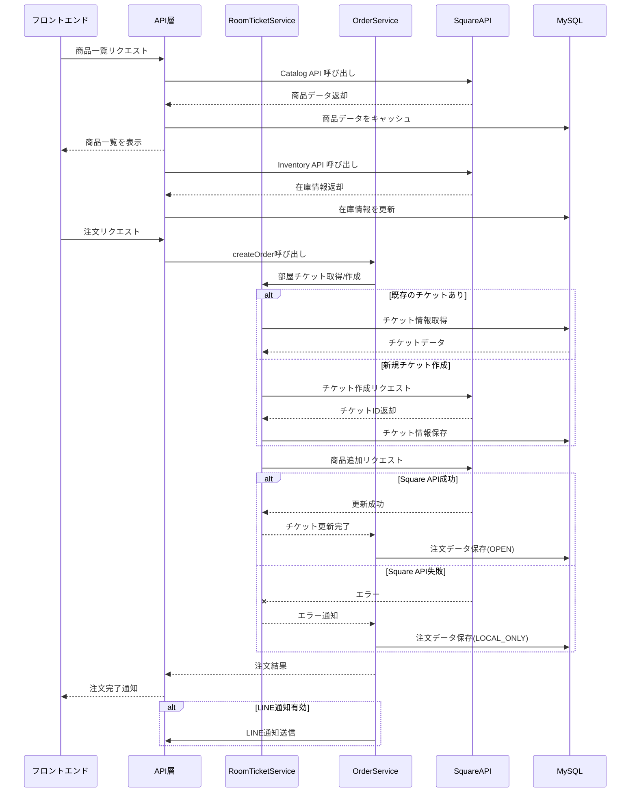

# Square と MySQL 接続仕様書

## 1. システム構成図

```
+-------------+      +----------------+      +------------------+
|   フロント   | <--> |   API層        | <--> |  MySQL データベース |
|   エンド     |      | （PHP Backend） |      |                  |
+-------------+      +----------------+      +------------------+
                           ↑↓
                     +---------------+
                     |  Square API   |
                     |  (外部サービス) |
                     +---------------+
```

## 2. コアコンポーネント

### データベース接続
- **`Database.php`** (/api/lib/Database.php)
  - MySQLデータベースとの接続を管理（PDOを使用）
  - 接続プールの管理とクエリ実行の抽象化
  - トランザクション管理（beginTransaction, commit, rollback）
  - エラーハンドリングと例外処理
  - ログ記録機能（操作ごとにタイムスタンプとエラー情報を記録）

### Square連携
- **`SquareService.php`** (/api/lib/SquareService.php)
  - Square APIとの通信処理（Square PHP SDK使用）
  - 保留伝票（オープンチケット）の作成と管理
  - 商品追加処理の実装
  - 応答の解析とエラーハンドリング
  - 商品カタログや在庫情報の取得
  - Webhook署名検証機能

### 部屋チケット管理
- **`RoomTicketService.php`** (/api/lib/RoomTicketService.php)
  - 部屋番号と保留伝票の関連付け管理
  - 保留伝票作成機能（createRoomTicket）
  - 保留伝票へのアイテム追加処理（addItemToRoomTicket）
  - ローカルフォールバック処理（Square API障害時）
  - 部屋チケットのステータス管理（OPEN, COMPLETED, CANCELED）
  - Square APIとローカルデータベースの同期

### 注文処理
- **`OrderService.php`** (/api/lib/OrderService.php)
  - 注文データの作成と管理（createOrder）
  - 部屋チケットへの注文アイテム追加（RoomTicketServiceと連携）
  - テストモード対応（Square連携なしの動作）
  - 注文履歴の保存と取得
  - 注文ステータス管理（OPEN, COMPLETED, CANCELED, LOCAL_ONLY）
  - LINE通知連携（注文完了時）

### ユーティリティ
- **`Utils.php`** (/api/lib/Utils.php)
  - ログ記録機能
  - エラーハンドリングヘルパー
  - JSONレスポンス生成
  - 入力検証と整形

## 3. データフロー

### データフロー図



### 商品情報の流れ
1. **商品マスタデータ**
   - Square CatalogAPIから商品情報を取得（getItems）
   - MySQLデータベースにキャッシュとして保存
   - `ProductService.php`が商品情報のCRUD操作を担当
   - APIを通じてフロントエンドに商品情報を提供

2. **在庫更新メカニズム**
   - Square InventoryAPIから在庫情報を取得（getInventoryCounts）
   - 注文時に在庫数をチェック（不足している場合も処理を続行）
   - フロントエンドでの表示時に在庫状況を反映

### 部屋付会計の流れ
1. **部屋チケット作成**
   - 初回注文時に`RoomTicketService.php`が部屋番号に紐づく保留伝票を作成
   - Square APIで保留伝票（`Order`オブジェクト）を作成（ステータス：OPEN）
   - メタデータに部屋番号と`is_room_ticket=true`を設定
   - 部屋番号とチケットIDの関連付けをroom_ticketsテーブルに保存
   - Square API障害時はローカルでフォールバック（`LOCAL_ONLY`ステータスで保存）

2. **注文追加処理**
   - フロントエンドからAPIリクエストを受信（/api/v1/orders POST）
   - `OrderService.php`が処理を開始
   - 部屋番号で既存のチケットを検索（`RoomTicketService.getRoomTicketByRoomNumber`）
   - 存在しない場合は新規作成（`RoomTicketService.createRoomTicket`）
   - 保留伝票に商品を追加（`SquareService.addItemToRoomTicket`）
     - 既存の伝票に`Order.lineItems`として商品を追加
     - 伝票のバージョン番号を使用して更新（競合防止）
   - 注文データをMySQLデータベースに保存（`orders`、`order_details`テーブル）
   - 注文ID（一意の識別子）を生成して返却

3. **結果処理と障害対応**
   - 注文成功時：注文履歴をデータベースに保存し、LINEに通知（設定時）
   - Square API障害時：
     - ローカルDBのみに注文を保存（`LOCAL_ONLY`ステータス）
     - 後で同期可能なようにメタデータを記録
   - 部分的なエラー時：トランザクションロールバックで整合性確保
   - テストモード時：Square連携なしでローカルDBのみに保存（`TEST_MODE`ステータス）

4. **トランザクション管理**
   - データベース操作ごとのトランザクション開始（`beginTransaction`）
   - 成功時のコミット（`commit`）
   - エラー時のロールバック（`rollback`）
   - ネストされた操作での整合性確保（ステップごとの例外キャッチ）

## 4. データベースと外部APIの連携

### MySQL データベーススキーマ
- **products**: 商品情報（id, square_item_id, name, price, description, category_id, stock_quantity, image_url等）
- **orders**: 注文情報（id, square_order_id, room_number, guest_name, order_status, total_amount, note, order_datetime, checkout_datetime等）
- **order_details**: 注文明細（id, order_id, square_item_id, product_name, unit_price, quantity, subtotal, note等）
- **room_tickets**: 部屋チケット管理（id, room_number, square_order_id, status, created_at, updated_at等）
- **line_room_links**: LINE連携情報（id, room_number, line_user_id, is_active等）
- **system_logs**: システムログ（id, log_level, log_source, message, created_at等）

### Square API連携
- **Room Tickets (保留伝票)**: Square Orders APIを使用して部屋ごとの保留伝票を作成・管理
  - 伝票作成（`createRoomTicket` → Square `createOrder` API）
  - 商品追加（`addItemToRoomTicket` → Square `updateOrder` API）
  - 伝票状態確認（`getRoomTicket` → Square `retrieveOrder` API）
- **商品カタログ**: Catalog APIを使用した商品情報の取得
  - 商品一覧取得（`getItems` → Square `listCatalog` API）
  - 画像取得（`getImageById` → Square `retrieveCatalogObject` API）
- **在庫管理**: Inventory APIを使用した在庫情報の取得
  - 在庫情報取得（`getInventoryCounts` → Square `batchRetrieveInventoryCounts` API）
- **認証**: APIキーを使用した認証処理
- **エラーハンドリング**: HTTP状態コードとエラーメッセージによる処理

## 5. エラーハンドリングと例外処理

### データベース接続エラー
- 接続失敗時のログ記録と例外スロー
- データベース操作ごとの詳細なエラーログ記録
- 実行前・実行後のクエリのパラメータとパフォーマンス情報ログ
- エラーレベルに応じた表示制御（DEBUG, INFO, WARNING, ERROR）

### API処理エラー
- 通信エラー時のリトライなし（適切なエラーメッセージを返却）
- APIエラー応答の詳細なログ記録（エラーコード、カテゴリ、詳細メッセージ）
- Square SDK例外（ApiException）のキャッチと処理
- 保留伝票操作失敗時のフォールバック処理（LOCAL_ONLYモード）

### ローカルフォールバック
- Square API障害時のローカルDBのみでの動作継続
- 再同期可能な形式でのデータ保存（後でSquareと同期可能）
- 特殊ステータス（`LOCAL_ONLY`, `TEST_MODE`）によるフラグ管理
- フォールバック状態の明示的なログ記録

### トランザクション整合性
- 部分的な処理成功時のロールバックメカニズム
  - `Database.php`の`beginTransaction`, `commit`, `rollback`メソッド
  - 各操作の`try-catch`ブロック内でのトランザクション管理
- 重複注文防止対策（同一部屋番号での注文）
  - 既存チケットの検索と再利用
- ネストされた操作での例外処理
  - 外部API障害時のローカルフォールバック
  - データベースエラー時の適切なメッセージ生成

## 6. セキュリティ対策

### データ保護
- 顧客情報の最小限の保存
  - 必須情報のみをデータベースに記録（部屋番号、注文内容等）
- 部屋番号と注文情報の関連付けによる認証
  - チケットベースの認証で、最小限の個人情報で運用
- Square側での機密情報管理
  - 支払い情報はシステム内に保存せず、Hotel PMS側で管理

### 通信セキュリティ
- すべてのAPI通信でのHTTPS使用
- SquareとのAPI通信における証明書検証
- Webhook署名検証による不正リクエスト防止
  - `validateWebhookSignature`メソッドでの署名検証

### 認証と認可
- 部屋チケットベースの認証システム
  - チケットトークンによるAPIアクセス制御
- APIアクセスの認証要件
  - 認証トークンの検証と部屋情報の関連付け
- 権限に基づくアクセス制御
  - 自分の部屋の注文のみにアクセス可能

## 7. テストと障害対応

### テストモード
- 環境検出による自動テストモード切替
  - ローカル環境（127.0.0.1, ::1）での自動検出
  - URL内の「test」キーワードによる検出
  - TEST_MODE定数による明示的指定
- Square API連携なしのローカル動作テスト
  - ダミーのSquare Order IDを生成して動作確認
  - 特殊ステータス「TEST_MODE」による区別

### ローカルフォールバック
- Square API障害時の継続動作
  - APIエラー発生時にローカルDBのみで処理継続
  - 「LOCAL_ONLY」ステータスでの注文記録
  - 再同期機能の土台整備

### 監視とロギング

#### トランザクションログ
- すべての注文と保留伝票操作の詳細ログ記録
  - `Utils.log`による構造化ログ記録
  - 操作種別、パラメータ、結果の詳細記録
- タイムスタンプとユニークIDによる追跡可能性
  - 各操作に一意のIDを付与
  - 時系列でのトレース可能性確保
- 複数レベルのログ（DEBUG, INFO, WARNING, ERROR）
  - 重要度に応じたログレベル設定
  - 環境に応じたログ表示制御

#### エラー監視とデバッグ
- 様々なコンテキストでのログ記録
  - Database.php内のクエリログ
  - 各サービスクラスでの操作ログ
  - API通信の詳細ログ
- スタックトレースの記録
  - 例外発生時の詳細な実行パス記録
  - エラー原因の特定を容易化
- パフォーマンスメトリクス記録
  - クエリ実行時間の計測と記録
  - 長時間実行操作の特定