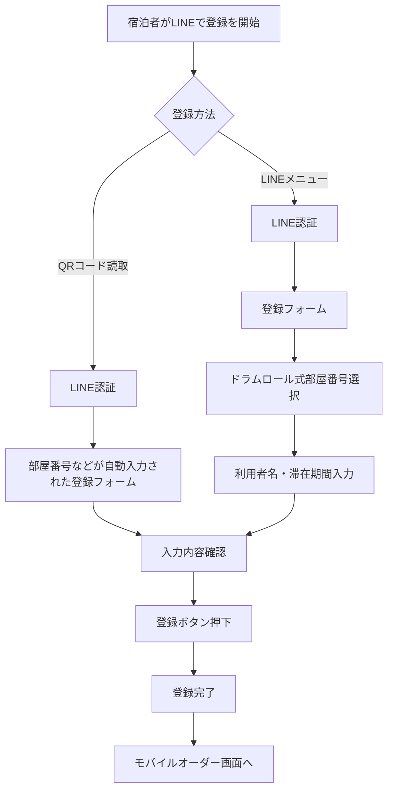
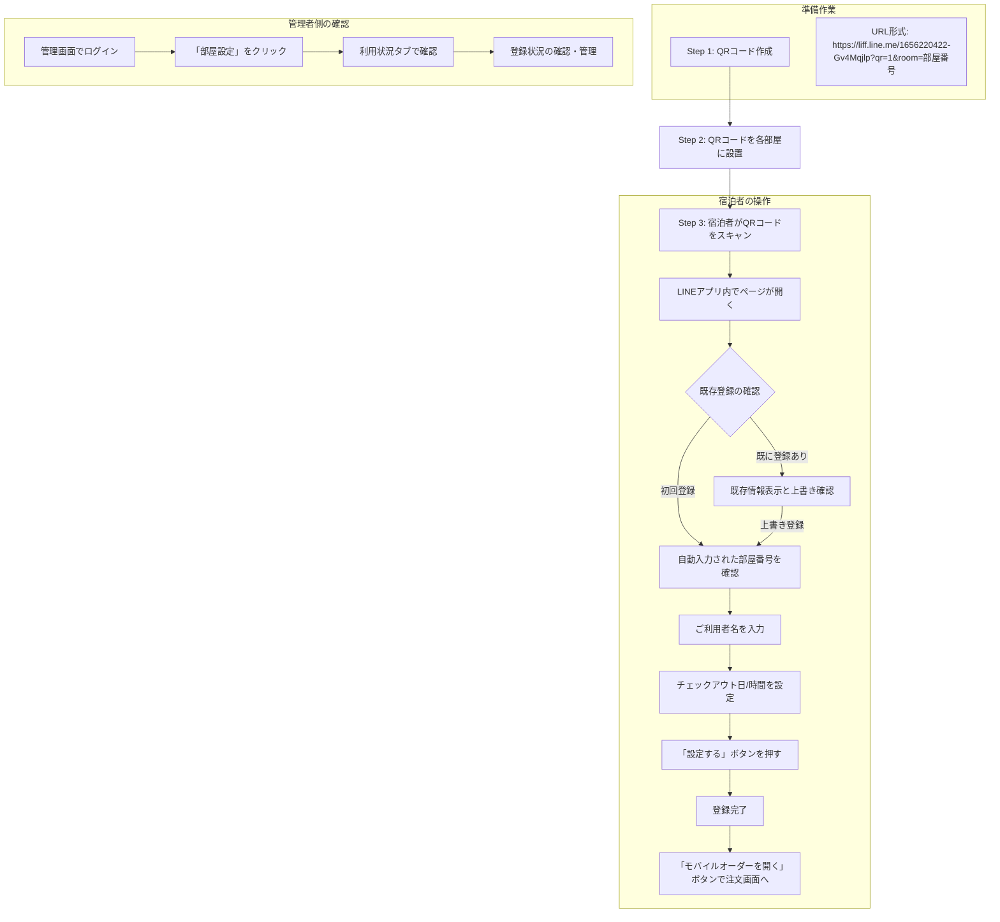
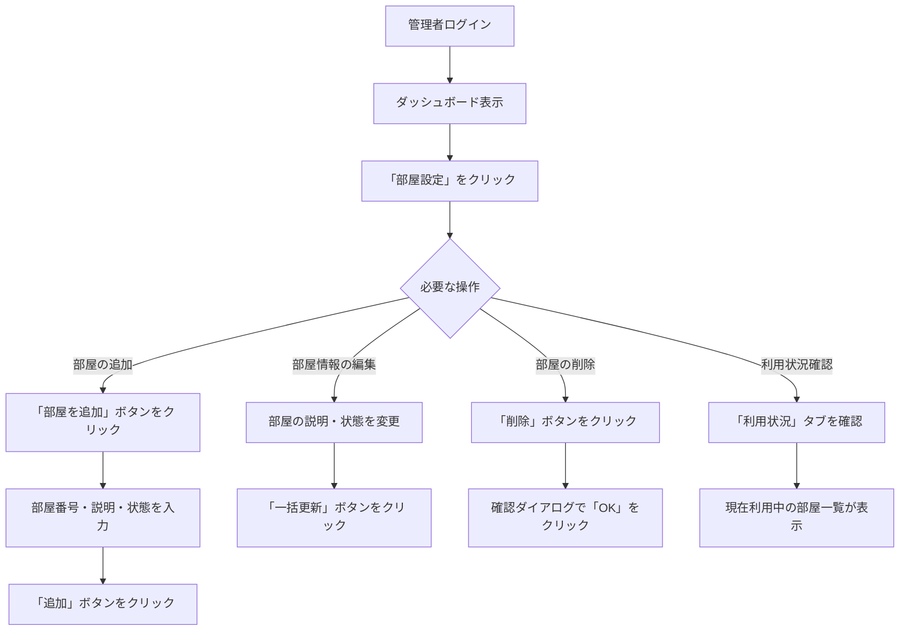

# LINE部屋番号登録モジュール仕様書

## 1. 概要

LINEユーザーと部屋番号を紐づけるための登録システムです。LINEのLIFF（LINE Front-end Framework）を利用し、ユーザーが自身のLINEアカウントと宿泊している部屋番号を関連付けることができます。このシステムにより、ユーザーはLINEを通じてモバイルオーダーやその他のサービスを利用できるようになります。

## 2. 機能一覧

- LINEユーザー認証
- 部屋番号のドラムロール選択・登録
- ご利用者様氏名の入力
- チェックイン日/チェックアウト日/チェックアウト時間の設定
- 管理画面による部屋番号管理と利用状況確認
- QRコードを利用した簡単登録
- 既存登録情報の確認・更新
- チェックアウト時の自動クリーンアップ

## 3. システム構成

### 3.1 ディレクトリ構造

```
register/
├── index.php              # メインのLIFFページ
├── css/
│   ├── style.css          # メインスタイルシート
│   └── picker.css         # ドラムロール選択用スタイル
├── js/
│   ├── liff-init.js       # LIFF初期化処理
│   ├── api.js             # APIリクエスト用ヘルパー関数
│   ├── picker.js          # ドラムロール選択コンポーネント
│   └── app.js             # アプリケーションロジック
└── api/
    ├── register.php       # 部屋情報登録API
    ├── room.php           # 部屋情報取得API
    └── lib/               # ユーティリティライブラリ

admin/
├── index.php              # 管理ダッシュボード
├── roomsetting.php        # 部屋設定管理画面
└── api/admin/
    ├── roomdata.php       # 部屋データ取得API
    └── saveroom.php       # 部屋データ保存API
```

### 3.2 関連テーブル

#### roomdatasettings テーブル
部屋情報のマスターデータを保存します。

| カラム | 型 | 説明 |
|-------|-----|------|
| id | int | 主キー、自動採番 |
| room_number | varchar(5) | 部屋番号（一意） |
| description | varchar(255) | 部屋の説明 |
| is_active | tinyint(1) | アクティブ状態 (1:有効, 0:無効) |
| last_update | timestamp | 最終更新日時 |

#### line_room_links テーブル
LINEユーザーと部屋番号の紐づけ情報を保存します。

| カラム | 型 | 説明 |
|-------|-----|------|
| id | int | 主キー、自動採番 |
| line_user_id | varchar(255) | LINEユーザーID（一意） |
| room_number | varchar(20) | 部屋番号 |
| user_name | varchar(255) | ご利用者様氏名 |
| check_in_date | date | チェックイン日 |
| check_out_date | date | チェックアウト日 |
| access_token | varchar(64) | アクセストークン |
| is_active | tinyint(1) | アクティブ状態 (1:有効, 0:無効) |
| created_at | timestamp | 作成日時 |
| updated_at | timestamp | 更新日時 |

## 4. 利用フロー

### 4.1 部屋番号登録の基本フロー



### 4.2 QRコードからの登録フロー（施設管理者向け）



#### QRコード作成方法

1. 以下の形式でURLを作成します
   ```
   https://liff.line.me/1656220422-Gv4Mqjlp?qr=1&room=部屋番号
   ```
   例: 部屋「fg#01」の場合 → `https://liff.line.me/1656220422-Gv4Mqjlp?qr=1&room=fg%2301`

2. このURLをQRコード生成サービス（例: [QRコードジェネレーター](https://www.qr-code-generator.com/)）に入力

3. 生成されたQRコードを印刷して各部屋に設置（チェックイン時に案内用として配布も可能）

#### 既存登録がある場合の処理

宿泊者が既に部屋登録済みの状態でQRコードをスキャンした場合、以下のように処理されます：

1. 既存登録情報が画面に表示されます（現在の部屋番号、チェックイン/アウト日時）
2. 「この情報を上書きしますか？」という確認メッセージが表示されます
3. 「はい」を選択すると、新しいQRコードの部屋情報に基づいた登録フォームが表示されます
4. 「いいえ」を選択すると、既存登録を維持したままモバイルオーダー画面に移動します

この機能により：
- 複数の部屋への誤登録を防止
- 部屋移動があった場合に簡単に情報を更新可能
- チェックイン/アウト日の変更にも対応

### 4.3 管理画面での運用フロー



## 5. API仕様

### 5.1 部屋情報取得 API (`register/api/room.php`)

#### リクエスト
- メソッド: POST
- ボディ（JSON）:
```json
{
  "token": "LINE_ID_TOKEN",
  "action": "get_rooms",
  "active_only": true
}
```

#### レスポンス（成功時）
```json
{
  "success": true,
  "rooms": ["fg#01", "fg#02", "fg#03", "fg#04", "fg#05"]
}
```

### 5.2 部屋情報登録 API (`register/api/register.php`)

#### リクエスト
- メソッド: POST
- ボディ（JSON）:
```json
{
  "token": "LINE_ID_TOKEN",
  "room_number": "fg#01",
  "user_name": "山田太郎",
  "check_in": "2023-07-01",
  "check_out": "2023-07-03",
  "check_out_time": "11:00"
}
```

#### レスポンス（成功時）
```json
{
  "success": true,
  "message": "部屋番号が正常に登録されました",
  "registration_id": 123,
  "registration_type": "new"
}
```

### 5.3 管理画面用部屋データ取得 API (`api/admin/roomdata.php`)

#### リクエスト
- メソッド: GET
- パラメータ:
  - token: 管理者認証トークン（必須）
  - usage: 利用状況も取得する場合は1（オプション）
  - active: アクティブな部屋のみ取得する場合は1（オプション）

#### レスポンス（成功時）
```json
{
  "success": true,
  "rooms": [
    {
      "id": 1,
      "room_number": "fg#01",
      "description": "101号室",
      "is_active": 1,
      "last_update": "2023-07-01 10:00:00"
    }
  ],
  "usage": [
    {
      "room_number": "fg#01",
      "user_name": "山田太郎",
      "check_in_date": "2023-07-01",
      "check_out_date": "2023-07-03",
      "is_active": 1
    }
  ]
}
```

### 5.4 管理画面用部屋データ保存 API (`api/admin/saveroom.php`)

#### リクエスト
- メソッド: POST
- データ:
  - token: 管理者認証トークン（必須）
  - action: add, update, delete のいずれか（必須）
  - room_number: 部屋番号（追加時必須）
  - description: 部屋の説明（追加時オプション）
  - is_active: アクティブ状態（追加時オプション）
  - room_data: JSON形式の部屋データ（更新時必須）
  - room_id: 部屋ID（削除時必須）

#### レスポンス（成功時）
```json
{
  "success": true,
  "message": "部屋を追加しました"
}
```

## 6. 管理画面の操作方法

### 6.1 部屋設定の基本操作

#### 部屋を追加する
1. 管理画面にログイン
2. ナビゲーションから「部屋設定」をクリック
3. 「部屋を追加」ボタンをクリック
4. 部屋番号（5文字以内）、説明（任意）を入力し、有効/無効を選択
5. 「追加」ボタンをクリック

#### 部屋情報を編集する
1. 管理画面の「部屋設定」画面で部屋一覧を表示
2. 編集したい部屋の説明や有効/無効状態を変更
3. 「一括更新」ボタンをクリック

#### 部屋を削除する
1. 管理画面の「部屋設定」画面で部屋一覧を表示
2. 削除したい部屋の行にある「削除」ボタンをクリック
3. 確認ダイアログで「OK」をクリック
   ※利用中の部屋は削除できません

### 6.2 ダッシュボードでの確認

管理ダッシュボードでは以下の部屋関連の統計情報が確認できます:
- 登録部屋数: システムに登録されている部屋の総数
- 利用可能部屋数: 現在アクティブ（有効）な部屋の数

## 7. エラーハンドリング

- すべてのAPIエンドポイントでは、エラーが発生した場合はJSONレスポンスでエラーメッセージを返します
- クライアント側では、エラーメッセージを分かりやすく表示
- エラーログは `/logs/` ディレクトリに保存され、自動的にローテーション（200KB超過）されます:
  - `register_api.log`: 登録処理のログ
  - `room_api.log`: 部屋情報取得のログ
  - `roomsetting.log`: 管理画面操作のログ

## 8. セキュリティ考慮事項

- LINEログインによるユーザー認証
- LINE IDトークンを使用した安全な認証
- 部屋情報の管理者権限による保護
- トランザクション処理によるデータ整合性の確保
- SQLインジェクション対策（PDOプリペアドステートメント使用）
- エラーメッセージの適切な制限（本番環境）
- ログファイルの自動ローテーション

## 9. インストールとセットアップ

### 9.1 データベースのセットアップ

```sql
-- 部屋マスターテーブル
CREATE TABLE `roomdatasettings` (
  `id` int(11) NOT NULL AUTO_INCREMENT,
  `room_number` varchar(5) NOT NULL,
  `description` varchar(255) DEFAULT NULL,
  `is_active` tinyint(1) NOT NULL DEFAULT 1,
  `last_update` timestamp NOT NULL DEFAULT current_timestamp() ON UPDATE current_timestamp(),
  PRIMARY KEY (`id`),
  UNIQUE KEY `room_number` (`room_number`)
) ENGINE=InnoDB DEFAULT CHARSET=utf8mb4;

-- LINE部屋紐づけテーブル
CREATE TABLE `line_room_links` (
  `id` int(11) NOT NULL AUTO_INCREMENT,
  `line_user_id` varchar(255) NOT NULL,
  `room_number` varchar(20) DEFAULT NULL,
  `user_name` varchar(255) DEFAULT NULL,
  `check_in_date` date DEFAULT NULL,
  `check_out_date` date DEFAULT NULL,
  `access_token` varchar(64) DEFAULT NULL,
  `is_active` tinyint(1) DEFAULT 1,
  `created_at` timestamp NULL DEFAULT current_timestamp(),
  `updated_at` timestamp NULL DEFAULT current_timestamp() ON UPDATE current_timestamp(),
  PRIMARY KEY (`id`),
  UNIQUE KEY `line_user_id` (`line_user_id`),
  KEY `room_number` (`room_number`),
  KEY `access_token` (`access_token`)
) ENGINE=InnoDB DEFAULT CHARSET=utf8mb4;
```

### 9.2 初期データ登録

```sql
-- 部屋データの初期登録例
INSERT INTO `roomdatasettings` (`room_number`, `description`, `is_active`) VALUES
('fg#01', '101号室', 1),
('fg#02', '102号室', 1),
('fg#03', '103号室', 1),
('fg#04', '104号室', 1),
('fg#05', '105号室', 1);
```

## 10. トラブルシューティング

### 10.1 よくある問題と解決策

| 問題 | 考えられる原因 | 解決策 |
|-----|-------------|-----|
| 部屋が選択できない | 部屋マスターに登録されていない | 管理画面から部屋を追加する |
| 部屋が表示されない | 部屋が無効に設定されている | 管理画面で部屋を有効に設定する |
| QRコードが動作しない | URLが正しくない | QRコードのURLを確認し再生成する |
| 登録エラーが発生する | ネットワークの問題 | ネットワーク接続を確認する |
| 管理画面にアクセスできない | 認証情報が間違っている | 管理者に正しいログイン情報を確認する |

### 10.2 ログの確認方法

1. サーバー上のログディレクトリ `/logs/` にアクセス
2. 対応するログファイルを開いて確認:
   - `register_api.log`: 登録時のエラー
   - `room_api.log`: 部屋情報取得時のエラー
   - `roomsetting.log`: 管理画面操作時のエラー

## 11. 将来の拡張性

- LINE通知機能の追加（モバイルオーダー完了時など）
- 部屋タイプやフロア情報の追加
- 顧客情報管理の強化
- 多言語対応の強化
- 利用統計分析機能の追加
