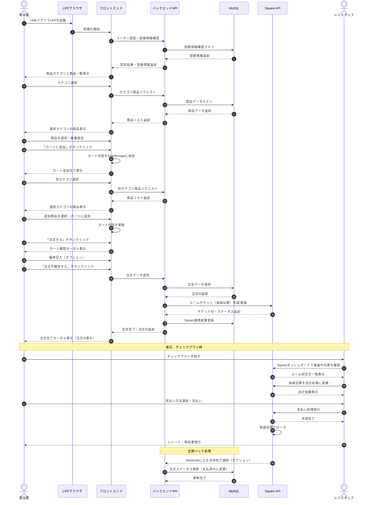

# フロントエンド機能仕様書

## 1. システム概要

FGSquareのフロントエンドは、LINEのLIFFフレームワークを活用した宿泊施設向けルームサービスオーダーシステムです。ユーザーはLINE上で直感的に商品を閲覧、選択し、部屋付会計（ルームチャージ）として注文することができます。バックエンドAPIとMySQLデータベース、およびSquareの保留伝票機能と連携し、宿泊客が自分の部屋に商品を注文するプロセスを実現しています。注文は保留伝票としてSquareシステムに記録され、宿泊施設のチェックアウト時に一括精算されます。

## 2. コアコンポーネント

### フロントエンド構成
- **`index.php`** (/order/index.php)
  - メインのフロントエンドエントリーポイント
  - 基本的なHTML構造とUIコンポーネントの配置
  - LIFFの初期化スクリプトとCSSスタイルの読み込み
  - ローディング画面、エラー画面、商品一覧表示領域の定義
  - カート確認モーダル、注文完了モーダルのHTML構造の提供

### JavaScriptモジュール
- **`liff-init.js`** (/order/js/liff-init.js)
  - LIFF SDKの初期化と認証処理
  - LIFFブラウザの動作環境検出
  - ユーザープロフィール取得と部屋情報の紐付け確認
  - 部屋紐付けチェックと未紐付け時の処理
  - エラー表示機能
  - LINEメッセージ送信機能（LIFFブラウザ内の場合のみ）

- **`api.js`** (/order/js/api.js)
  - バックエンドAPIとの通信を担当するモジュール
  - APIエンドポイント定義と基本のHTTPリクエスト処理
  - 商品カテゴリ、商品一覧、商品詳細の取得機能
  - 注文作成、注文履歴取得、注文詳細取得機能
  - カートデータの保存、取得、クリア機能
  - データキャッシュ機能とエラーハンドリング

- **`cart.js`** (/order/js/cart.js)
  - カート機能を管理するモジュール
  - 商品の追加、削除、数量更新機能
  - 小計、消費税、合計金額の計算
  - カート内容のローカルストレージ保存と復元
  - カートUIの更新と表示処理
  - 注文データの作成と整形

- **`ui.js`** (/order/js/ui.js)
  - UI操作とイベント処理を管理するモジュール
  - カテゴリリスト表示と選択処理
  - 商品リスト表示と商品要素の動的生成
  - カートモーダル、注文完了モーダルの初期化と制御
  - 注文処理と成功/失敗時の表示切替
  - レスポンシブ対応とUI状態管理

- **`app.js`** (/order/js/app.js)
  - アプリケーションの初期化とメインロジック
  - 各モジュール間の連携と状態管理
  - LIFF初期化完了の待機処理
  - 画面サイズに応じたレイアウト調整
  - エラーロギングとグローバルエラーハンドリング
  - デバッグモード検出と開発環境判定

### スタイルシート
- **`style.css`** (/order/css/style.css)
  - アプリケーション全体のスタイル定義
  - レスポンシブデザインの実装（モバイルファースト）
  - カラーテーマとフォント設定
  - レイアウト構造（ヘッダー、フッター、メインコンテンツ）
  - 商品カテゴリサイドバーのスタイル
  - 商品リスト、商品カードのデザイン
  - カートモーダル、注文完了モーダルのスタイル
  - ローディング、エラー表示のアニメーションと見た目
  - スケルトンローディングエフェクト

## 3. 機能詳細

### LIFF初期化と認証フロー
1. **初期化プロセス**
   - `liff-init.js`がページロード時に自動的にLIFF SDKを初期化
   - liff-config.jsonからLIFF IDを取得
   - LINEにログインしていない場合はLINEログイン画面へリダイレクト
   - ログイン後、ユーザープロフィールを取得

2. **部屋情報の紐付け確認**
   - ユーザープロフィール取得後、部屋との紐付け情報を確認
   - 紐付けがない場合はエラーメッセージを表示し、操作を制限
   - 紐付けがある場合は部屋番号を表示し、商品カテゴリと商品を読み込む

3. **LINE固有機能の抽象化**
   - LINEアプリ内での実行判定機能
   - LINEへのメッセージ送信機能（LIFFブラウザ内のみ）
   - LIFFブラウザを閉じる機能

### カテゴリと商品表示フロー
1. **カテゴリ読み込み**
   - LIFF初期化完了後、`loadCategories()`が`api.js`の`getCategories()`を呼び出し
   - カテゴリデータをキャッシュし、カテゴリリストを表示
   - 最初のカテゴリを自動選択

2. **商品読み込み**
   - カテゴリ選択時、`selectCategory()`が`api.js`の`getProductsByCategory()`を呼び出し
   - 選択されたカテゴリの商品データを取得しキャッシュ
   - `displayProducts()`で商品リストを表示
   - 各商品カードに数量選択と「カートに追加」ボタンを配置

3. **商品表示の最適化**
   - スケルトンローディング表示でUXを向上
   - 商品画像のレイジーロード対応（将来実装予定）
   - 在庫切れ商品の表示切替え

### カート機能
1. **カート操作**
   - 商品カードの「カートに追加」ボタンで`addToCart()`を呼び出し
   - カート内商品の表示、数量更新、削除機能
   - ローカルストレージによるカート状態の永続化
   - カート合計金額の自動計算（税抜き、消費税、税込み合計）

2. **カートモーダル**
   - フッターの「注文する」ボタンでカート確認モーダルを表示
   - カート内商品の一覧表示と金額内訳の表示
   - 備考入力欄の提供
   - 「注文を確定する」ボタンと「戻る」ボタンの配置

### 注文プロセス
1. **注文データ作成**
   - カート確認モーダルで「注文を確定する」ボタン押下時に`createOrderData()`を呼び出し
   - LINE userId、部屋番号、商品リスト、金額情報、備考を含む注文データを構築

2. **注文API呼び出し**
   - 注文データを`api.js`の`createOrder()`でバックエンドAPIに送信
   - 処理中の表示とボタン無効化によるUI制御

3. **注文結果処理**
   - 注文成功時は`handleOrderSuccess()`を呼び出し
   - 注文完了モーダルを表示し、注文番号を表示
   - カートをクリアし、買い物を継続するか注文履歴を見るかの選択肢を提供
   - エラー時はエラーメッセージを表示し、再試行を促す

### エラーハンドリング
1. **UI側エラー処理**
   - ネットワークエラー、API応答エラーの検出と表示
   - 再試行ボタンによるリカバリーオプションの提供
   - エラーログのコンソール出力

2. **グローバルエラーキャッチ**
   - `window.addEventListener('error')`による未捕捉エラーの検出
   - 開発環境での詳細エラー情報表示
   - ユーザーフレンドリーなエラーメッセージの提供

## 4. 処理フロー図

### 注文からチェックアウトまでのシーケンス
以下のシーケンス図は、ユーザーが画面を表示してから商品を選択し、注文、Square側での処理、そしてチェックアウト時の会計処理に至るまでの一連のフローを示しています。



このシーケンス図は、LINE LIFFを利用したモバイルオーダーシステムの全体的なフローを表しており、フロントエンド、バックエンド、およびSquareシステムとの連携を示しています。特に、注文データがSquareの保留伝票として保存され、チェックアウト時にレジスタッフによって処理される流れが明確になっています。

## 5. API連携詳細

### エンドポイント
- **カテゴリ取得**: `/api/v1/products/categories.php`
  - 商品カテゴリの一覧を取得
  - レスポンス例:
    ```json
    {
      "success": true,
      "categories": [
        {
          "id": "food",
          "name": "フード",
          "icon_url": "images/icons/food.png"
        },
        {
          "id": "drink",
          "name": "ドリンク",
          "icon_url": "images/icons/drinks.png"
        }
      ],
      "timestamp": "2023-01-01 12:00:00"
    }
    ```

- **商品取得**: `/api/v1/products/index.php?category_id={categoryId}`
  - 特定カテゴリの商品一覧を取得
  - レスポンス例:
    ```json
    {
      "success": true,
      "products": [
        {
          "id": "123",
          "name": "商品名",
          "description": "商品説明",
          "price": 1000,
          "image_url": "images/products/123.jpg",
          "available_quantity": 10
        }
      ],
      "timestamp": "2023-01-01 12:00:00"
    }
    ```

- **注文作成**: `/api/v1/orders`
  - POST: 新規注文を作成
  - リクエスト例:
    ```json
    {
      "line_user_id": "U1234567890abcdef",
      "room_number": "101",
      "items": [
        {
          "product_id": "123",
          "quantity": 2,
          "price": 1000
        }
      ],
      "subtotal": 2000,
      "tax": 200,
      "total": 2200,
      "notes": "氷多めでお願いします"
    }
    ```
  - レスポンス例:
    ```json
    {
      "success": true,
      "order": {
        "id": "order_123456",
        "status": "confirmed",
        "created_at": "2023-01-01 12:30:00"
      },
      "timestamp": "2023-01-01 12:30:00"
    }
    ```

### データ永続化と同期
1. **ローカルストレージの活用**
   - カート情報をlocalStorageに保存し、ページ再読み込み時に復元
   - カテゴリと商品データをJavaScriptのメモリ内キャッシュとして保持

2. **APIキャッシュ戦略**
   - カテゴリと商品データは一度取得したらクライアント側でキャッシュ
   - 明示的な更新アクションまたはセッション終了までキャッシュを維持
   - 将来的にはService Workerによるオフラインサポートを検討

## 6. レスポンシブ設計

### 画面サイズ対応
- **デスクトップ/タブレット**
  - カテゴリのサイドバー表示（固定位置）
  - 商品リストをグリッドレイアウトで表示
  - モーダルは中央配置でデスクトップ向けサイズ

- **モバイル(768px以下)**
  - カテゴリをトップの水平スクロールに変更
  - 商品リストを単一カラムに縮小
  - モーダルを画面幅に合わせて拡大
  - ボタンサイズの拡大とタップ領域の最適化

- **小型モバイル(480px以下)**
  - テキストサイズの縮小とパディングの調整
  - ヘッダーとフッターの最適化
  - 商品情報の簡略化表示

### UIコンポーネントの適応
- **フレックスボックス/グリッドレイアウト**
  - コンテナの流動的なサイズ変更
  - メディアクエリによるレイアウト切替え

- **タッチインタラクション**
  - タップターゲットを最小44px×44pxに設定
  - スワイプ操作のサポート（カテゴリ切替えなど）
  - モバイルでのスクロール体験の最適化

## 7. セキュリティ対策

### データ保護
- **クライアントサイドの制限**
  - 価格情報など重要データの改ざん防止（サーバーサイド再検証）
  - 決済情報はフロントエンドで非保持
  - ローカルストレージに保存するデータの厳選（個人情報は非保存）

### LINE認証の活用
- **LIFFフレームワークによる認証**
  - LINE公式認証を活用したセキュアなユーザー特定
  - ユーザーIDトークンをサーバーサイドで検証（将来実装）
  - 部屋紐付け情報の厳格な管理

### 通信セキュリティ
- **HTTPS通信**
  - すべてのAPI通信でHTTPS利用
  - 転送中データの保護
  - オリジン間リソース共有(CORS)の適切な設定

## 8. 将来拡張計画

### 機能拡張予定
- **オフラインサポート**
  - Service Workerによるオフライン操作対応
  - バックグラウンド同期機能の実装

- **通知機能**
  - 注文ステータス変更時のプッシュ通知
  - LINE Messaging APIとの連携強化

- **多言語対応**
  - i18nフレームワークの導入
  - 言語切替えUIの実装

### パフォーマンス最適化
- **コード分割とバンドリング**
  - ES Modulesの活用
  - webpackなどのモジュールバンドラーの導入

- **画像最適化**
  - レスポンシブイメージ
  - WebPフォーマット対応
  - 画像のレイジーロード実装

### アクセシビリティ強化
- **スクリーンリーダー対応**
  - ARIA属性の適切な使用
  - キーボードナビゲーションの改善

- **カラーコントラスト**
  - WCAG AAレベルのコントラスト比達成
  - ハイコントラストモードのサポート 