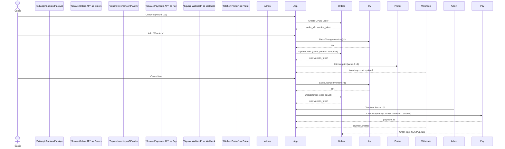

# Square連携モバイルオーダーシステム 概要仕様書

## 1. 目的・背景

Square API のうち **商品マスタ・在庫・決済・公式売上レポート** 機能のみを採用し、部屋別オーダー運用・キッチン連携・詳細レシート生成などの顧客体験部分を外部アプリで担う二層構成を採用する。本書は役割分担、データフロー、API 利用箇所を俯瞰し、導入から運用完了までの全体像を共有する。

## 2. システム構成と役割

| コンポーネント                                 | 主な役割                                                                                                     | 主要 API / 技術 |
| --------------------------------------- | -------------------------------------------------------------------------------------------------------- | ----------- |
| **Square プラットフォーム**                     | ・商品カタログ(Catalog)                                                                                         |             |
| ・在庫管理(Inventory)                        |                                                                                                          |             |
| ・決済・売上(Payments / Orders)               |                                                                                                          |             |
| ・公式レポート(Reporting)                      |                                                                                                          |             |
| ・在庫/決済 Webhook 発信                       | Catalog API, Inventory API, Orders API, Payments API, Webhook (inventory.count.updated, payment.created) |             |
| **モバイルオーダー外部アプリ**                       | ・部屋別オーダー UI (Web/PWA)                                                                                    |             |
| ・キッチンチケット印刷 (ESC/POS or Star CloudPRNT) |                                                                                                          |             |
| ・部屋別オーダーDB (RDS/MySQL)                  |                                                                                                          |             |
| ・在庫調整リクエスト生成                            |                                                                                                          |             |
| ・Square Webhook 受信 & キャッシュ更新            |                                                                                                          |             |
| ・チェックアウト用合算会計作成                         | REST (Node/PHP), ESC/POS, Websocket, JWT 認証                                                              |             |
| **管理ダッシュボード (外部)**                      | ・部屋別売上/在庫状況リアルタイム表示                                                                                      |             |
| ・返品/割引操作                                |                                                                                                          |             |
| ・Square と外部 DB の日次突合                    | React / Next.js, Chart ほか                                                                                |             |

## 3. データモデル（簡易）

### 3.1 外部 DB テーブル

* **rooms**: room\_id, status, current\_order\_id
* **orders\_ext**: id, room\_id, created\_at, subtotal, tax, status
* **order\_lines**: id, order\_id, catalog\_object\_id (SKU), qty, unit\_price
* **inventory\_cache**: catalog\_object\_id, qty\_in\_stock, updated\_at

### 3.2 Square 側

* **CatalogItemVariation**: catalog\_object\_id
* **InventoryCount**: location\_id, catalog\_object\_id, state, quantity
* **Order (集約用)**: reference\_id=room\_id, 1 行商品 (ROOM\_CHARGE\_xxx)

## 4. ライフサイクルフロー（Mermaid シーケンス図）

## 5. API 呼び出し一覧 API 呼び出し一覧

| フェーズ     | エンドポイント                                   | 主なパラメータ                                       | 備考                   |
| -------- | ----------------------------------------- | --------------------------------------------- | -------------------- |
| ① チェックイン | `POST /v2/orders`                         | state=OPEN, reference\_id=room\_id            | base\_price\_money=0 |
| ② 注文追加   | `POST /v2/inventory/changes/batch-create` | type=ADJUSTMENT, -qty                         | 在庫減算                 |
|          | `PUT /v2/orders/{order_id}`               | base\_price\_money=新小計, metadata.detail\_json | version\_token 必須    |
| ③ キャンセル  | 同上 (在庫+qty)                               |                                               |                      |
| ④ 会計確定   | `POST /v2/payments`                       | source\_id=CASH/EXTERNAL, amount=subtotal     | autocomplete=true    |
| ⑤ レポート   | `GET /v2/payments?begin_time=...`         |                                               | 日次締め                 |

## 6. セキュリティ & 可用性

* PAT はサーバーのみ保管。モバイル UI とは自前 API 経由 (JWT)
* すべての Square 呼び出しに `idempotency_key` を付与
* Inventory API 呼び出し失敗時は再試行キューに格納
* Webhook 受信は署名検証 (`x-square-signature`) を必須
* 主要ロジックは Cloud Run / ECS にデプロイ、RDS はマルチ AZ

## 7. 障害シナリオ例

| 事象               | 検知                              | 自動リカバリ         | 手動対応        |
| ---------------- | ------------------------------- | -------------- | ----------- |
| Square 403 / 5xx | API レスポンス監視                     | 再試行キュー & バックオフ | PAT ローテーション |
| POS 直販で在庫枯渇      | inventory.count.updated Webhook | UI に在庫切れ表示     | 仕入補充指示      |
| DB–Square 売上差異   | 日次突合で差分発見                       | –              | 会計チーム確認     |

## 8. 導入ステップ (スプリント例)

1. **S1**: Catalog/Inventory 連携 PoC
2. **S2**: 部屋別オーダー UI + DB
3. **S3**: Inventory 調整と Webhook 同期
4. **S4**: 決済フロー & レポート突合
5. **S5**: キッチン印刷 & 通知
6. **S6**: 運用ドライラン & カットオーバー

## 9. 拡張ロードマップ

* オンライン決済 (カード) 対応
* サジェスト機能 (在庫別おすすめ)
* ロイヤルティ連携 (Square Loyalty API)

---

**作成日**: 2025-05-06

*本書は概要レベルの仕様であり、詳細パラメータや API バージョンは開発開始時点の Square ドキュメントに従って更新すること。*
