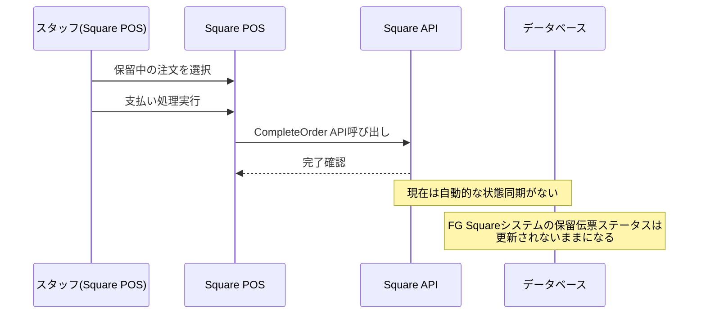
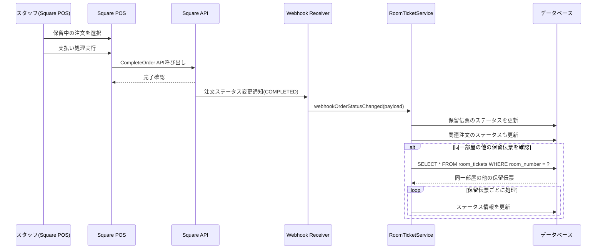
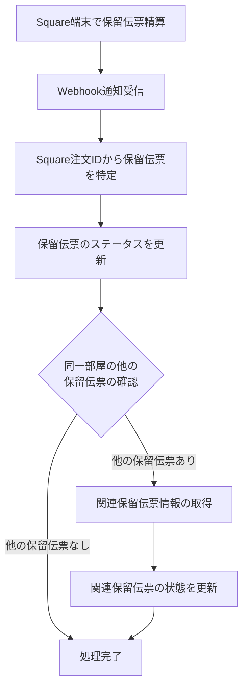
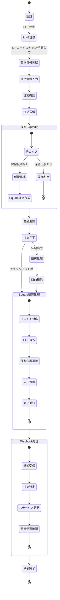
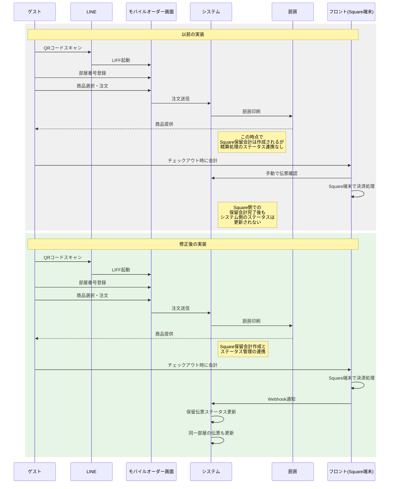
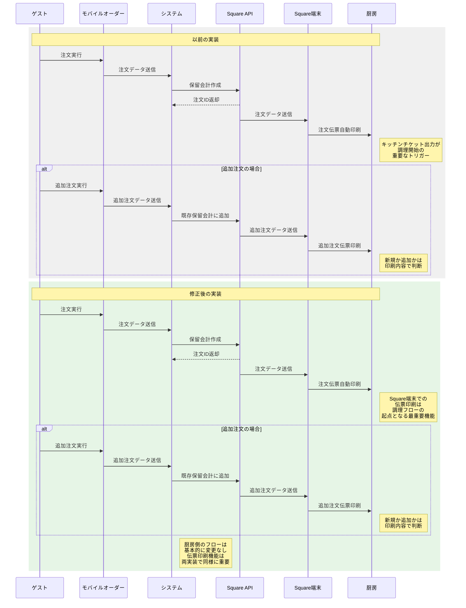
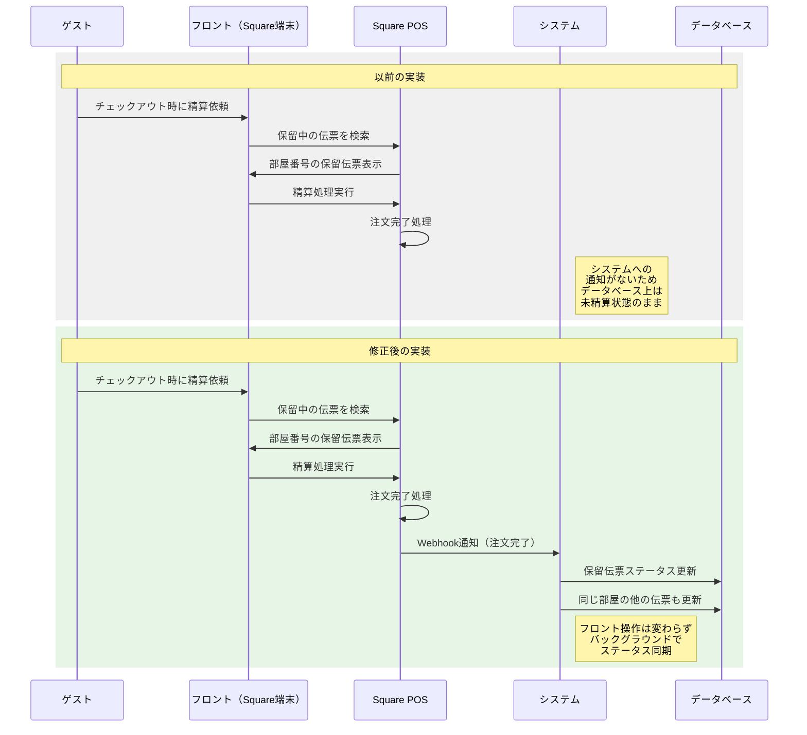
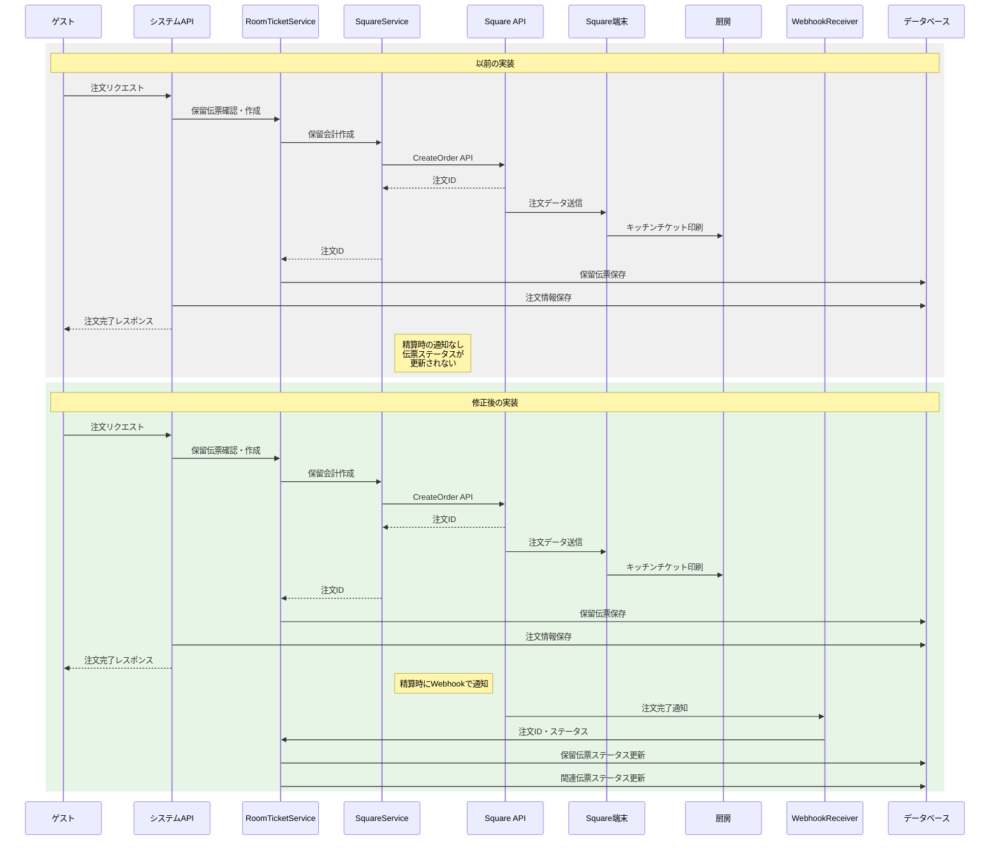

# Square保留会計処理フロー詳細

## 0. 現在の実装と修正要点

### 現在の実装の課題
現在の実装では、保留会計機能と精算処理の連携において以下の課題があります：

1. **注文と保留会計の連携不足**:
   - 客室オーダーがSquareの保留会計に正しく追加されるが、後続の精算処理との連携が不十分
   - Square端末で保留会計が精算された際のステータス更新が実装されていない

2. **Square端末での決済完了通知の未処理**:
   - Square端末で保留会計の決済が完了した際の通知を適切に処理するメカニズムが不足
   - Square APIのWebhookやポーリングによるステータス確認が十分に活用されていない

3. **部屋付会計の管理**:
   - LINEで登録された部屋番号に紐づく保留会計の管理が十分でない
   - Square端末でのチェックアウト時精算と連携した保留伝票のステータス更新が不足

### 修正の方向性
以下の修正を実施することで、LINE登録の部屋番号とSquare保留会計機能を適切に連携させます：

1. **Webhook処理の実装**:
   - Square APIからのWebhook通知を受信・処理する仕組みの実装
   - 注文ステータス変更イベントに応じたローカルDBの更新処理の実装

2. **Square精算連携の強化**:
   - Square端末で保留会計が精算された際の処理を実装
   - 部屋番号に紐づく全ての保留伝票を適切に管理するロジックの追加

3. **保留伝票の適切なステータス管理**:
   - 注文完了、精算完了など状態遷移の明確化
   - 状態に応じた適切な処理の実装（新規注文の受付可否、履歴表示など）

これらの修正により、LINEでの部屋番号登録から注文、Square端末での精算までのフローがシームレスに連携し、運用上の課題を解決します。

## 1. 概要

FG Squareモバイルオーダーシステムでは、注文処理とSquare連携において「保留会計」という概念を利用しています。このドキュメントでは、注文完了後のSquare連携処理から保留会計の締め処理までの一連のフローを詳細に解説します。

## 2. システム構成要素

* **RoomTicketService**: 保留伝票管理を担当するサービスクラス
* **SquareService**: Square APIとの連携を担当するサービスクラス
* **OrderService**: 注文処理を担当するサービスクラス
* **room_tickets**: 保留伝票を管理するデータベーステーブル
* **orders**: 注文情報を管理するデータベーステーブル
* **order_details**: 注文商品詳細を管理するデータベーステーブル

## 3. 注文完了〜保留会計処理フロー

### 3.1 注文完了時の処理

ユーザーがモバイルオーダー画面で注文を完了すると、以下のフローで処理されます：

1. **注文情報の受信**:
   - フロントエンドは`/api/v1/orders`エンドポイントにPOSTリクエストを送信
   - リクエストには部屋番号、商品情報、LINE User ID（オプション）などが含まれる

2. **OrderServiceによる注文処理**:
   - `OrderService::createOrder()` メソッドが呼び出される
   - パラメータとして部屋番号、商品情報、ゲスト名、備考、LINE User IDが渡される

3. **保留伝票の確認・作成**:
   - `RoomTicketService::getRoomTicketByRoomNumber()` で既存の保留伝票を確認
   - 保留伝票が存在しない場合、`RoomTicketService::createRoomTicket()` で新規作成

4. **Square注文の作成**:
   - `SquareService::createRoomTicket()` でSquare上に保留オーダーを作成
   - Square APIから注文ID（square_order_id）を取得
   - この注文IDをroom_ticketsテーブルに関連付けて保存
   - **重要: この時点でSquare端末が注文データを受信し、厨房用の注文伝票（キッチンチケット）が自動的に印刷されます**

5. **注文情報の保存**:
   - 生成された注文IDと商品情報をordersテーブルおよびorder_detailsテーブルに保存
   - LINE User IDも紐づけて保存（指定されている場合）

6. **注文完了レスポンス**:
   - APIはフロントエンドに成功レスポンスを返す
   - フロントエンドは注文完了メッセージをユーザーに表示

### 3.2 Squareからのレスポンス受信

Squareへの注文作成リクエスト後、以下の処理が行われます：

1. **同期的なレスポンス処理**:
   - `SquareService::createRoomTicket()` はSquare APIから注文作成の応答を受け取る
   - レスポンスには Square 注文ID（Orderオブジェクト）が含まれる
   - 成功時はOrderオブジェクトを返し、失敗時はfalseを返す

2. **保留会計情報の取得**:
   - `SquareService::getOrder()` メソッドを使用し、最新の注文情報を随時取得可能
   - 注文のステータス、商品、金額などの情報を含む

3. **エラーハンドリング**:
   - APIエラーが発生した場合、エラーログに詳細を記録
   - 再試行メカニズムが実装されており、一時的なエラーは自動的に再試行

### 3.3 保留会計への商品追加処理

すでに存在する保留会計（保留伝票）に商品を追加する場合：

1. **既存の保留伝票の取得**:
   - `RoomTicketService::getRoomTicketByRoomNumber()` で部屋番号に紐づく保留伝票を取得

2. **Square注文の更新**:
   - `SquareService::addItemToRoomTicket()` メソッドを使用
   - 既存の注文に新しい商品（LineItem）を追加
   - 追加にはSquare APIの `UpdateOrder` エンドポイントを使用

3. **注文情報の更新**:
   - 同じ保留伝票IDの注文に関連付けて、新しい商品情報をorder_detailsテーブルに保存
   - ordersテーブルの合計金額も更新

4. **LineItem数の制限確認**:
   - Square APIの制限として1注文あたり15アイテムまでの制限がある
   - 制限に達する場合、自動的に新しい保留伝票を作成してその伝票に商品を追加

## 4. 現在の精算処理フロー

現在の実装では、Square端末での保留会計精算時の処理は以下のように行われます：



## 5. 修正後の精算処理フロー

修正後の実装では、Square端末での保留会計精算時の処理は以下のように改善されます：



### 5.1 部屋に複数の保留伝票がある場合の処理



## 6. 実装修正内容

### 6.1 Webhook処理の実装

Square APIからのWebhook通知を処理するエンドポイントを実装します：

```php
// api/v1/webhooks/square.php

require_once __DIR__ . '/../../lib/Utils.php';
require_once __DIR__ . '/../../lib/RoomTicketService.php';
require_once __DIR__ . '/../../lib/WebhookService.php';

// リクエストボディの取得
$payload = file_get_contents('php://input');
$headers = getallheaders();

// Webhookの検証
$webhookService = new WebhookService();
if (!$webhookService->verifySquareWebhook($payload, $headers)) {
    http_response_code(401);
    echo json_encode(['status' => 'error', 'message' => 'Invalid webhook signature']);
    exit;
}

// ペイロードのデコード
$data = json_decode($payload, true);

// イベントタイプの確認
if (isset($data['type']) && $data['type'] === 'order.updated') {
    $roomTicketService = new RoomTicketService();
    
    // 注文情報の取得
    $orderId = $data['data']['object']['order_id'] ?? '';
    $orderStatus = $data['data']['object']['state'] ?? '';
    
    if (!empty($orderId)) {
        // 注文ステータスに基づいて処理
        if ($orderStatus === 'COMPLETED') {
            // 保留伝票の更新
            $result = $roomTicketService->updateTicketStatusBySquareOrderId($orderId, 'COMPLETED');
            
            if ($result) {
                // 同じ部屋の他の保留伝票も確認・更新
                $roomTicketService->updateRelatedTickets($orderId);
                
                Utils::log("Webhook: 注文 {$orderId} を完了状態に更新しました", 'INFO', 'webhook');
                echo json_encode(['status' => 'success']);
            } else {
                Utils::log("Webhook: 注文 {$orderId} の更新に失敗しました", 'ERROR', 'webhook');
                echo json_encode(['status' => 'error', 'message' => 'Failed to update ticket']);
            }
        } else {
            // その他のステータス更新
            $result = $roomTicketService->updateTicketStatusBySquareOrderId($orderId, $orderStatus);
            Utils::log("Webhook: 注文 {$orderId} のステータスを {$orderStatus} に更新しました", 'INFO', 'webhook');
            echo json_encode(['status' => 'success']);
        }
    } else {
        Utils::log("Webhook: 注文IDが見つかりません", 'ERROR', 'webhook');
        echo json_encode(['status' => 'error', 'message' => 'Order ID not found']);
    }
} else {
    // 未対応のイベントタイプ
    Utils::log("Webhook: 未対応のイベントタイプ: " . ($data['type'] ?? 'unknown'), 'INFO', 'webhook');
    echo json_encode(['status' => 'success', 'message' => 'Event type not handled']);
}
```

### 6.2 RoomTicketServiceの拡張

`RoomTicketService`クラスに以下のメソッドを追加します：

```php
/**
 * Square注文IDから保留伝票のステータスを更新
 * 
 * @param string $squareOrderId Square注文ID
 * @param string $status 新しいステータス
 * @return bool 成功時はtrue、失敗時はfalse
 */
public function updateTicketStatusBySquareOrderId($squareOrderId, $status) {
    self::logMessage("updateTicketStatusBySquareOrderId 開始: squareOrderId={$squareOrderId}, status={$status}", 'INFO');
    
    try {
        // 対象の保留伝票を検索
        $query = "SELECT * FROM room_tickets WHERE square_order_id = ? LIMIT 1";
        $ticket = $this->db->selectOne($query, [$squareOrderId]);
        
        if (!$ticket) {
            self::logMessage("Square注文ID {$squareOrderId} に対応する保留伝票が見つかりません", 'WARNING');
            return false;
        }
        
        // トランザクション開始
        $this->db->beginTransaction();
        
        try {
            // 保留伝票のステータスを更新
            $updateQuery = "UPDATE room_tickets SET status = ?, updated_at = NOW() WHERE id = ?";
            $this->db->execute($updateQuery, [$status, $ticket['id']]);
            
            // 関連する注文のステータスも更新
            $orderUpdateQuery = "UPDATE orders SET order_status = ?, updated_at = NOW() WHERE square_order_id = ?";
            $this->db->execute($orderUpdateQuery, [$status, $squareOrderId]);
            
            // トランザクションコミット
            $this->db->commit();
            
            self::logMessage("保留伝票 {$ticket['id']} のステータスを {$status} に更新しました", 'INFO');
            return true;
        } catch (Exception $e) {
            // トランザクションロールバック
            $this->db->rollback();
            throw $e;
        }
    } catch (Exception $e) {
        self::logMessage("updateTicketStatusBySquareOrderId エラー: " . $e->getMessage(), 'ERROR');
        return false;
    }
}

/**
 * 同一部屋の関連保留伝票を更新
 * 
 * @param string $squareOrderId 元のSquare注文ID
 * @return array 更新された保留伝票の配列
 */
public function updateRelatedTickets($squareOrderId) {
    self::logMessage("updateRelatedTickets 開始: squareOrderId={$squareOrderId}", 'INFO');
    
    try {
        // 元の保留伝票を検索して部屋番号を取得
        $query = "SELECT * FROM room_tickets WHERE square_order_id = ? LIMIT 1";
        $ticket = $this->db->selectOne($query, [$squareOrderId]);
        
        if (!$ticket) {
            self::logMessage("Square注文ID {$squareOrderId} に対応する保留伝票が見つかりません", 'WARNING');
            return [];
        }
        
        $roomNumber = $ticket['room_number'];
        self::logMessage("部屋番号 {$roomNumber} の関連保留伝票を検索します", 'INFO');
        
        // 同じ部屋番号の他の保留伝票を検索
        $query = "SELECT * FROM room_tickets WHERE room_number = ? AND id != ? AND status = 'OPEN'";
        $relatedTickets = $this->db->select($query, [$roomNumber, $ticket['id']]);
        
        if (empty($relatedTickets)) {
            self::logMessage("部屋番号 {$roomNumber} の他の保留伝票はありません", 'INFO');
            return [];
        }
        
        $updatedTickets = [];
        foreach ($relatedTickets as $relatedTicket) {
            // トランザクション開始
            $this->db->beginTransaction();
            
            try {
                // 保留伝票のステータスを更新
                $updateQuery = "UPDATE room_tickets SET status = 'COMPLETED', updated_at = NOW() WHERE id = ?";
                $this->db->execute($updateQuery, [$relatedTicket['id']]);
                
                // 関連する注文のステータスも更新
                $orderUpdateQuery = "UPDATE orders SET order_status = 'COMPLETED', updated_at = NOW() WHERE square_order_id = ?";
                $this->db->execute($orderUpdateQuery, [$relatedTicket['square_order_id']]);
                
                // トランザクションコミット
                $this->db->commit();
                
                $updatedTickets[] = $relatedTicket;
                self::logMessage("関連保留伝票 {$relatedTicket['id']} を完了状態に更新しました", 'INFO');
            } catch (Exception $e) {
                // トランザクションロールバック
                $this->db->rollback();
                self::logMessage("関連保留伝票の更新中にエラー: " . $e->getMessage(), 'ERROR');
            }
        }
        
        self::logMessage("部屋番号 {$roomNumber} の関連保留伝票を {$count} 件更新しました", 'INFO');
        return $updatedTickets;
    } catch (Exception $e) {
        self::logMessage("updateRelatedTickets エラー: " . $e->getMessage(), 'ERROR');
        return [];
    }
}
```

### 6.3 WebhookServiceの実装

Squareからのウェブフック通知を検証するためのサービスクラスを実装します：

```php
// api/lib/WebhookService.php

/**
 * Webhook検証・処理サービスクラス
 */
class WebhookService {
    /**
     * Square Webhookの検証
     * 
     * @param string $payload Webhookペイロード
     * @param array $headers リクエストヘッダー
     * @return bool 検証成功時はtrue、失敗時はfalse
     */
    public function verifySquareWebhook($payload, $headers) {
        // Square Webhook署名検証（実際の実装ではConfigurationから署名キーを取得）
        // 実装例として単純な検証を行います
        // 本番環境では適切な署名検証が必要です
        
        // テスト環境では簡易的に検証をスキップすることも可能
        if (defined('SQUARE_ENVIRONMENT') && SQUARE_ENVIRONMENT !== 'production') {
            Utils::log("テスト環境のためWebhook検証をスキップします", 'INFO', 'webhook');
            return true;
        }
        
        // 署名ヘッダーの確認
        $signatureKey = isset($headers['X-Square-Signature']) ? $headers['X-Square-Signature'] : '';
        
        if (empty($signatureKey)) {
            Utils::log("Webhook検証失敗: 署名ヘッダーがありません", 'ERROR', 'webhook');
            return false;
        }
        
        // 設定から署名シークレットを取得
        $webhookSecret = defined('SQUARE_WEBHOOK_SECRET') ? SQUARE_WEBHOOK_SECRET : '';
        
        if (empty($webhookSecret)) {
            Utils::log("Webhook検証失敗: 署名シークレットが設定されていません", 'ERROR', 'webhook');
            return false;
        }
        
        // HMAC-SHA256による署名検証
        $calculatedSignature = hash_hmac('sha256', $payload, $webhookSecret);
        
        if ($calculatedSignature !== $signatureKey) {
            Utils::log("Webhook検証失敗: 署名が一致しません", 'ERROR', 'webhook');
            return false;
        }
        
        Utils::log("Webhook検証成功", 'INFO', 'webhook');
        return true;
    }
}
```

## 7. 注文と精算処理のライフサイクル（修正後）



## 8. まとめ

この修正により、以下の点が改善されます：

1. **精算処理の連携強化**:
   - Square端末で保留会計が精算された際の通知をWebhookで受信
   - 保留伝票と注文のステータスを自動的に更新

2. **Square連携の強化**:
   - Webhook処理の実装によるリアルタイム状態同期
   - 注文完了処理の明確な実装

3. **部屋番号単位の処理**:
   - 同じ部屋番号に紐づく複数の保留伝票を一括管理
   - 1つの保留伝票が精算された際に関連する保留伝票も自動的に更新

これらの修正により、LINEでの部屋番号登録から注文、Square端末での精算までのフローがシームレスに連携し、運用上の課題を解決することができます。既存の注文完了までの処理を維持しながら、以降の処理を拡張することで、システムの安定性と拡張性を両立しています。

## 9. 実装比較：各視点から見たフロー

### 9.1 以前の実装と修正後の実装比較

#### 9.1.1 ゲスト視点からのフロー比較



#### 9.1.2 厨房視点からのフロー比較



#### 9.1.3 フロント（Square端末）視点からのフロー比較



#### 9.1.4 システム視点からのフロー比較



### 9.2 主な改善点

以前の実装と修正後の実装を比較すると、主に以下の点が改善されています：

1. **ゲスト視点の改善**:
   - 体験そのものは変わらない（LINEログインから注文、精算まで同一フロー）
   - バックグラウンドでの処理改善により、履歴表示などの正確性が向上

2. **厨房視点の改善**:
   - **Square端末からの注文伝票（キッチンチケット）印刷は両実装において最も重要な機能であり、変更なく維持されています**
   - 厨房への注文表示フローは維持（操作変更なし）
   - システム内部でステータス管理が改善されることで、将来的な拡張性が向上

3. **フロント視点の改善**:
   - Square端末での操作方法は変わらない
   - **Square端末での注文受信と伝票印刷機能は完全に維持されています**
   - 精算後にシステム側のステータスが自動更新されるため、データの整合性が向上
   - 手動での確認作業が不要になる

4. **システム視点の改善**:
   - **注文時のSquare端末への通知と伝票印刷は両実装で同様に実装されています**
   - Webhook処理の実装により、精算情報のリアルタイム反映
   - 同一部屋番号の保留伝票を一括処理する機能の追加
   - ステータス管理の明確化とデータの整合性向上

## 10. 注文伝票（キッチンチケット）に関する重要事項

本システムにおいて、注文データがSquare端末に送信され、キッチンチケットが自動印刷される機能は最も重要な機能の一つです。この機能に関する要点を以下にまとめます：

### 10.1 注文伝票の出力フロー

1. **注文データの送信**:
   - モバイルオーダーからの注文データはAPIを通じてシステムに送信されます
   - システムはSquare APIを使用して保留会計を作成します

2. **Square端末での受信**:
   - Square APIは注文データをSquare端末（レジ）に送信します
   - Square端末は設定に基づいてキッチンチケットを自動的に印刷します

3. **伝票の種類**:
   - 新規注文: 部屋番号と全商品リストを含む完全な伝票
   - 追加注文: 同じ部屋番号の追加商品のみを含む伝票

### 10.2 実装上の注意点

- **Square設定**:
  - Square管理画面で「新規注文時に自動印刷」の設定が有効になっていることが必要です
  - 追加注文の場合も同様に自動印刷の設定が必要です

- **伝票印刷の確実性**:
  - 伝票印刷は調理開始の唯一のトリガーであるため、注文データが確実にSquare端末に届き、印刷されることが最重要です
  - 今回の修正はバックエンドのステータス管理を改善するものであり、この重要なキッチンチケット印刷機能には一切影響しません

この注文伝票印刷機能は、厨房運営において中核となる機能であり、どちらの実装においても同様に実装・維持されています。
