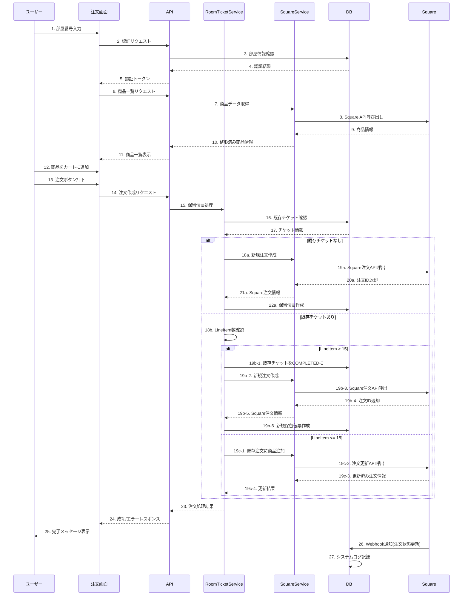
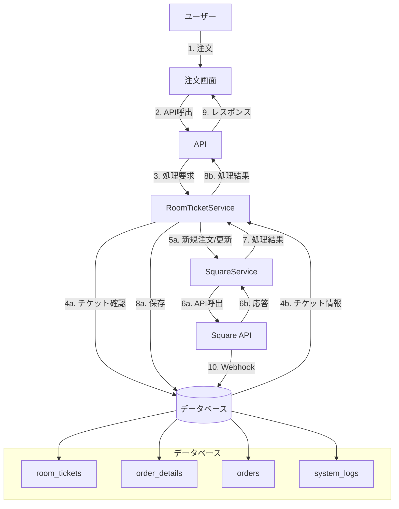
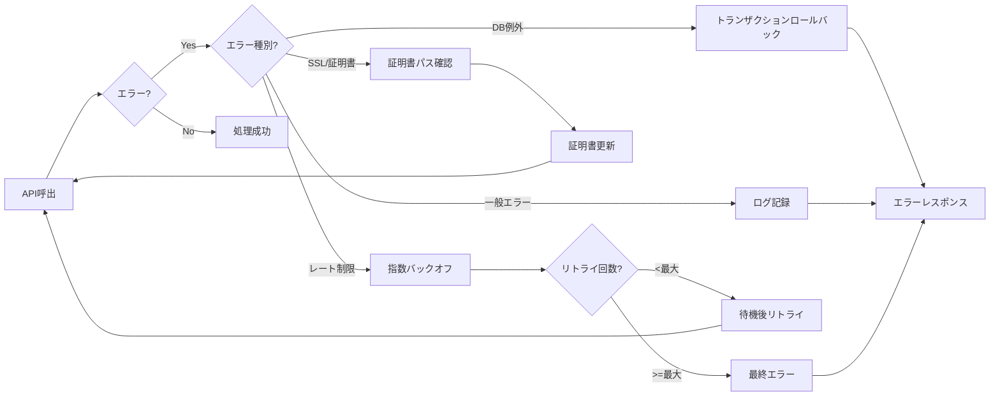

# FG Square モバイルオーダーシステム修正仕様書

## 0. 緊急対応: 注文API 500エラー修正

現在、注文処理時に以下のエラーが発生しています：

```
POST https://test-mijeos.but.jp/fgsquare/api/v1/orders 500 (Internal Server Error)
```

### 0.1 原因と対策

この問題は以下の原因が特定されています：

1. **データベーススキーマの不足**: `room_tickets`テーブルに`guest_name`カラムが存在せず、データベース操作が失敗している
   * エラー: `SQLSTATE[42S22]: Column not found: 1054 Unknown column 'guest_name' in 'field list'`

2. **Square API v30.0との互換性問題**: 金額フィールド(`order.total_money`)がAPIによって自動計算される仕様に変更された
   * エラー: `Read-only field is calculated and cannot be set by a client., Field=order.total_money`

3. **SSL証明書の問題**: SquareServiceがAPIリクエスト時に証明書を正しく参照できていない可能性がある

4. **ログディレクトリのパーミッション不足**: ログ書き込み権限がなく処理が中断している可能性がある

### 0.2 緊急修正手順

以下の順に対応を行ってください：

```bash
# 1. APIエラーログの確認
ssh hideakikurata@192.168.3.57
sudo tail -100 /var/log/apache2/error.log

# 2. Lolipopサーバー上のエラーログ確認（FTP経由でダウンロード）
# /home/users/web/LAA1207717/fgsquare/logs/error.log の内容確認

# 3. room_ticketsテーブルにguest_nameカラムを追加
mysql -h mysql323.phy.lolipop.lan -u LAA1207717 -p LAA1207717-rtspreader
# パスワード入力後、以下のSQLを実行
ALTER TABLE room_tickets ADD COLUMN guest_name VARCHAR(100) DEFAULT '';

# 4. ログディレクトリのパーミッション修正
chmod 775 /home/users/web/LAA1207717/fgsquare/logs/
chown -R LAA1207717:www-data /home/users/web/LAA1207717/fgsquare/logs/

# 5. 証明書ディレクトリの作成と権限設定
mkdir -p /home/users/web/LAA1207717/fgsquare/certificates/
chmod 755 /home/users/web/LAA1207717/fgsquare/certificates/
```

**SquareService.php修正内容（互換性の問題を解決）:**

1. **金額フィールド問題の修正**：
   - `createRoomTicket`関数内の`total_money`フィールド設定を削除
   - `has_money_fields`を`false`に設定

2. **SearchOrdersRequest問題の修正**:
   - `searchOrdersByRoom`メソッドを修正し、配列ではなく適切なオブジェクトを使用
   - `SearchOrdersRequest`、`SearchOrdersFilter`、`SearchOrdersQuery`等のオブジェクトを使用

## 1. Square API 制約への対応

### 1.1 LineItem 上限 15 件対応
Square Orders API は 1 注文あたり概ね 15 明細でエラーを返します。現在の実装では明細数の制限を確認していないため、以下の変更が必要です。

**実装方針:** `RoomTicketService::addItemToRoomTicket()` 内で LineItem 数を取得し、15 件到達時に自動的に新しいチケットを作成します。

```php
// api/lib/RoomTicketService.php に追加
public function addItem($ticketId, $item) {
    // 既存のチケット情報を取得
    $ticket = $this->getRoomTicket($ticketId);
    $roomNumber = $ticket['room_number'];
    
    // LineItem数を取得
    $currentCount = 0;
    if (isset($ticket['square_data']['line_items'])) {
        $currentCount = count($ticket['square_data']['line_items']);
    }
    
    // 15件以上ある場合は新規チケット作成
    if ($currentCount >= 15) {
        $this->closeTicket($ticketId);              // status=COMPLETED に変更
        return $this->createNewTicket($roomNumber); // status=OPEN の新チケット作成
    }
    
    // 通常の商品追加処理を継続
    return $this->addToExistingTicket($ticketId, $item);
}
```

### 1.2 Idempotency Key の改善
現在の実装では一意性が保証されないキーを使用しているため、`Uuid::uuid4()` を使用した厳密に一意なキーを生成します。

**実装方針:** 
1. Composer で `ramsey/uuid` をインストール
2. リクエスト重複防止のための記録テーブルを追加
3. SquareService 内の全リクエストメソッドを更新

```php
// api/lib/SquareService.php 内の修正
use Ramsey\Uuid\Uuid;

// createOrder, createRoomTicket などの各メソッド内で
$idempotencyKey = Uuid::uuid4()->toString();
```

```sql
-- 重複リクエスト防止のためのテーブル
CREATE TABLE request_dedup (
    id_key CHAR(36) PRIMARY KEY,
    created_at TIMESTAMP DEFAULT CURRENT_TIMESTAMP
);
```

### 1.3 レート制限対応
Square API はレート制限を持っていますが、現在の実装ではリトライロジックがありません。

**実装方針:** 指数バックオフを使用したリトライロジックを実装します。

```php
// api/lib/SquareService.php に追加
private function executeWithRetry($callback, $maxRetries = 5) {
    $retry = 0;
    
    while (true) {
        try {
            return $callback();
        } catch (ApiException $e) {
            // レート制限エラーの場合のみリトライ
            if ($e->isApiError() && $e->getResponseCode() == 429) {
                if ($retry >= $maxRetries) {
                    throw $e; // 最大リトライ回数を超えたら例外を投げる
                }
                
                // 指数バックオフで待機（1, 2, 4, 8, 16秒）
                $waitTime = pow(2, $retry);
                self::logMessage("API rate limit exceeded. Retrying in {$waitTime} seconds. Retry {$retry+1}/{$maxRetries}", 'WARNING');
                sleep($waitTime);
                $retry++;
            } else {
                throw $e; // レート制限以外のエラーはそのまま投げる
            }
        }
    }
}
```

### 1.4 API Logs の有効活用
Square API の詳細なログを保存し、障害発生時の解析を容易にします。

**実装方針:** 全てのAPI呼び出しとレスポンスをログに記録し、Request-ID を含める。

```php
// api/lib/SquareService.php 内の各APIメソッドに追加
$response = $orderApi->createOrder($body);

// レスポンスをログに記録（成功・失敗にかかわらず）
$requestId = $response->getHeaders()->getRequestId();
$rawResponse = $response->getBody();
$logContext = [
    'request_id' => $requestId,
    'raw_response' => $rawResponse,
    'endpoint' => 'createOrder',
    'status_code' => $response->getStatusCode()
];
Utils::log("Square API Response", $response->isSuccess() ? 'INFO' : 'ERROR', 'SquareService', $logContext);

// ログファイルにも詳細を記録（/fgsquare/logs/ディレクトリに保存）
self::logMessage("Square API Request-ID: {$requestId}, Status: {$response->getStatusCode()}", 
    $response->isSuccess() ? 'INFO' : 'ERROR');
```

## 2. SSL/TLS および環境差異の解消

### 2.1 証明書パスの絶対指定
現在の実装では相対パスで証明書を指定しており、CLI/FPM の実行環境によって参照先が異なる問題があります。

**実装方針:** 以下の変更を行います。
1. 証明書を絶対パスで指定するよう `SquareService` クラスを修正
2. php.ini の設定を統一

```php
// api/lib/SquareService.php の __construct() 内で
// Lolipopサーバー環境に適した絶対パスを使用
$certPath = realpath(__DIR__ . '/../certificates/cacert.pem');
if (!$certPath || !file_exists($certPath)) {
    // Lolipopサーバーでの標準パス
    $certPath = '/home/users/web/LAA1207717/certificates/cacert.pem';
    if (!file_exists($certPath)) {
        // 最終フォールバックパス
        $certPath = '/home/users/web/LAA1207717/fgsquare/certificates/cacert.pem';
    }
}

$this->client = new SquareClient([
    'accessToken' => SQUARE_ACCESS_TOKEN,
    'environment' => $environment,
    'timeout' => 10,
    'connectTimeout' => 3,
    'curlOptions' => [
        CURLOPT_SSL_VERIFYPEER => true,
        CURLOPT_SSL_VERIFYHOST => 2,
        CURLOPT_CAINFO => $certPath,  // 絶対パスを使用
        CURLOPT_VERBOSE => true
    ]
]);

// 絶対パスをログに記録（/fgsquare/logs/ディレクトリに保存）
self::logMessage("SSL証明書パス: {$certPath}", 'INFO');
```

### 2.2 php.ini 設定の統一
FPM と CLI モードの設定を統一するために、Lolipopサーバー環境にあった設定を追加します。

```ini
; php.ini に追加（Lolipop環境用）
curl.cainfo = /home/users/web/LAA1207717/fgsquare/certificates/cacert.pem
openssl.cafile = /home/users/web/LAA1207717/fgsquare/certificates/cacert.pem
```

### 2.3 SSL証明書ローテーションスクリプトの実装
証明書の有効期限切れによる問題を防ぐため、自動更新スクリプトを実装します。

```php
// 新規ファイル: /fgsquare/cron/update_ssl_cert.php
<?php
/**
 * SSL証明書自動更新スクリプト
 * 毎週実行されるcronジョブとして設定
 */
 
// ログファイル設定
$logFile = __DIR__ . '/../logs/ssl_cert_update.log';
function logMessage($message) {
    global $logFile;
    $timestamp = date('Y-m-d H:i:s');
    file_put_contents($logFile, "[$timestamp] $message" . PHP_EOL, FILE_APPEND);
}

logMessage("SSL証明書更新プロセス開始");

// 証明書保存先ディレクトリ
$certDir = __DIR__ . '/../certificates';
if (!is_dir($certDir)) {
    mkdir($certDir, 0755, true);
    logMessage("証明書ディレクトリを作成: {$certDir}");
}

// 既存の証明書をバックアップ
$certFile = $certDir . '/cacert.pem';
if (file_exists($certFile)) {
    $backupFile = $certFile . '.' . date('Ymd');
    copy($certFile, $backupFile);
    logMessage("既存の証明書をバックアップ: {$backupFile}");
}

// 最新の証明書をダウンロード（curl.haxx.se から）
$remoteUrl = 'https://curl.se/ca/cacert.pem';
$result = false;

// curlが使用可能な場合
if (function_exists('curl_init')) {
    $ch = curl_init($remoteUrl);
    curl_setopt($ch, CURLOPT_RETURNTRANSFER, true);
    curl_setopt($ch, CURLOPT_SSL_VERIFYPEER, false); // 初回DL用に一時的に無効化
    $certContent = curl_exec($ch);
    $httpCode = curl_getinfo($ch, CURLINFO_HTTP_CODE);
    curl_close($ch);
    
    if ($httpCode == 200 && !empty($certContent)) {
        file_put_contents($certFile, $certContent);
        $result = true;
        logMessage("証明書を正常にダウンロードしました（cURL使用）");
    } else {
        logMessage("cURLによる証明書ダウンロードに失敗: HTTP Code {$httpCode}");
    }
}

// curlが使用できない場合はfile_get_contentsを試行
if (!$result && function_exists('file_get_contents')) {
    $context = stream_context_create([
        'ssl' => [
            'verify_peer' => false,
            'verify_peer_name' => false,
        ]
    ]);
    
    $certContent = @file_get_contents($remoteUrl, false, $context);
    if ($certContent !== false) {
        file_put_contents($certFile, $certContent);
        $result = true;
        logMessage("証明書を正常にダウンロードしました（file_get_contents使用）");
    } else {
        logMessage("file_get_contentsによる証明書ダウンロードに失敗");
    }
}

// 証明書のパーミッション設定
if ($result) {
    chmod($certFile, 0644);
    logMessage("証明書のパーミッションを設定: 0644");
    
    // 証明書の内容を確認
    $certInfo = openssl_x509_parse(file_get_contents($certFile));
    if ($certInfo) {
        $validFrom = date('Y-m-d H:i:s', $certInfo['validFrom_time_t']);
        $validTo = date('Y-m-d H:i:s', $certInfo['validTo_time_t']);
        logMessage("証明書情報: 有効期間 {$validFrom} ～ {$validTo}");
    } else {
        logMessage("証明書の解析に失敗しました");
    }
    
    logMessage("SSL証明書の更新が完了しました");
} else {
    logMessage("SSL証明書の更新に失敗しました");
    
    // バックアップから復元
    if (file_exists($backupFile)) {
        copy($backupFile, $certFile);
        logMessage("バックアップから証明書を復元しました");
    }
}

// cronへの設定方法を出力
echo "このスクリプトをcronに登録するには以下のコマンドを実行してください:\n";
echo "crontab -e\n";
echo "そして以下の行を追加:\n";
echo "0 0 * * 0 php /home/users/web/LAA1207717/fgsquare/cron/update_ssl_cert.php\n";
echo "これにより、毎週日曜日の午前0時に証明書の更新が実行されます。\n";
```

crontabへの登録コマンド（Lolipop環境用）:
```bash
# 毎週日曜日の午前0時に実行
0 0 * * 0 php /home/users/web/LAA1207717/fgsquare/cron/update_ssl_cert.php >> /home/users/web/LAA1207717/fgsquare/logs/cron.log 2>&1
```

## 3. MySQL スキーマ修正

現在のデータベーススキーマでは以下の問題があります：
- `room_tickets` テーブルに `guest_name` カラムが存在せず、データベース操作が失敗している
- `room_tickets` テーブルの UNIQUE 制約が単一カラムのため伝票履歴が保持できない
- 外部キー制約がなく、データ整合性が保証されない
- VARCHAR 長の不一致により JOIN パフォーマンスが低下

### 3.1 room_tickets テーブルの修正

```sql
-- guest_nameカラムの追加
ALTER TABLE room_tickets ADD COLUMN guest_name VARCHAR(100) DEFAULT '';

-- room_ticketsテーブルの単一UNIQUE制約を削除し、複合UNIQUEに変更
ALTER TABLE room_tickets DROP INDEX room_number;
CREATE UNIQUE INDEX uq_room_open ON room_tickets(room_number, status);

-- 外部キー制約の追加
ALTER TABLE order_details ADD CONSTRAINT fk_od_order 
FOREIGN KEY(order_id) REFERENCES orders(id) ON DELETE CASCADE;

-- VARCHAR長の統一（roomdatasettingsは VARCHAR(5)から VARCHAR(20)に変更）
ALTER TABLE roomdatasettings MODIFY room_number VARCHAR(20);
```

### 3.2 ステータスマスタテーブルの導入
拡張性向上のため、ENUM型ではなくステータスマスタテーブルを導入します。

```sql
-- ステータスマスターテーブル作成
CREATE TABLE status_master (
    status_code VARCHAR(20) PRIMARY KEY,
    description VARCHAR(100) NOT NULL,
    created_at TIMESTAMP DEFAULT CURRENT_TIMESTAMP
);

-- 初期データ投入
INSERT INTO status_master (status_code, description) VALUES
('OPEN', '保留中'),
('COMPLETED', '完了'),
('CANCELED', 'キャンセル');

-- room_ticketsテーブルの変更（既存データがある場合は移行スクリプトが必要）
ALTER TABLE room_tickets 
MODIFY COLUMN status VARCHAR(20) NOT NULL DEFAULT 'OPEN',
ADD CONSTRAINT fk_status FOREIGN KEY (status) REFERENCES status_master(status_code);
```

### 3.3 Lolipop環境でのデータベース接続設定
Lolipopサーバーでのデータベース接続情報を更新します。

```php
// dbconfig.php の修正
define('DB_HOST', 'mysql323.phy.lolipop.lan');
define('DB_NAME', 'LAA1207717-rtspreader');
define('DB_USER', 'LAA1207717');
define('DB_PASSWORD', 'mijeos12345');
```

## 4. コード改修指示

### 4.1 RoomTicketService.php の修正
本クラスは保留伝票の作成・管理を担当します。以下の修正を行います。

```php
// api/lib/RoomTicketService.php の createRoomTicket メソッドを修正
public function createRoomTicket(string $room): int
{
    $this->db->beginTransaction();
    try {
        // OPEN ステータスで保留伝票を作成
        $ticketId = $this->insertPending($room);
        
        // Square APIで注文を作成（UUID v4でべき等性を確保）
        $orderId = $this->squareService->createOrder($room);
        
        // Square注文IDと保留伝票を紐付け
        $this->bindSquareId($ticketId, $orderId);
        
        $this->db->commit();
        return $ticketId;
    } catch(Throwable $e) {
        $this->db->rollBack();
        $this->logger->error('Ticket creation failed', [
            'error' => $e->getMessage(),
            'trace' => $e->getTraceAsString(),
            'room' => $room
        ]);
        throw $e;
    }
}

// 15件制限に対応するaddItem機能の追加
public function addItem($ticketId, $item) {
    // LineItem数を取得
    $ticket = $this->getRoomTicket($ticketId);
    $currentCount = $this->getLineItemCount($ticketId);
    $roomNumber = $ticket['room_number'];
    
    if ($currentCount >= 15) {
        // 15件以上ある場合は新規チケット作成
        $this->closeTicket($ticketId);
        $newTicketId = $this->createRoomTicket($roomNumber);
        return $this->addItemToRoomTicket($roomNumber, [$item]);
    }
    
    // 既存チケットに追加
    return $this->addItemToRoomTicket($roomNumber, [$item]);
}

// ログディレクトリパスの更新
private static function initLogFile() {
    if (self::$logFile !== null) {
        return;
    }
    
    // 必ず /fgsquare/logs/ ディレクトリにログを保存
    $logDir = __DIR__ . '/../../logs';
    if (!is_dir($logDir)) {
        mkdir($logDir, 0755, true);
    }
    
    self::$logFile = $logDir . '/RoomTicketService.log';
    
    // ログローテーションのチェック
    self::checkLogRotation();
}
```

### 4.2 SquareService.php の修正
APIリクエストの信頼性向上のための修正を行います。特に500エラーの主要原因である金額フィールド問題を解決します。

```php
// api/lib/SquareService.php を修正

// createRoomTicket関数の修正 - 金額フィールドを削除
public function createRoomTicket($roomNumber, $guestName = '', $lineUserId = '') {
    self::logMessage("createRoomTicket 開始: roomNumber={$roomNumber}, guestName={$guestName}, lineUserId={$lineUserId}", 'INFO');
    
    // ベース処理は維持
    self::logMessage("Square API createRoomTicket 処理開始: locationId={$this->locationId}", 'INFO');
    
    // 接続テスト
    $testResult = $this->testConnection();
    self::logMessage("Square API接続テスト" . ($testResult ? "成功" : "失敗") . ": " . json_encode($testResult), 'INFO');
    
    // メタデータ設定
    if (!empty($lineUserId)) {
        $guestName = $this->setupGuestNameFromLineUserId($lineUserId);
    }
    
    $metadata = [
        'room_number' => $roomNumber,
        'guest_name' => $guestName,
        'order_source' => 'mobile_order',
        'is_room_ticket' => 'true',
        'note' => "Room {$roomNumber} Order"
    ];
    
    self::logMessage("注文メタデータを設定: " . json_encode($metadata), 'INFO');
    
    // べき等性キー生成
    $idempotencyKey = 'room_ticket_' . $roomNumber . '_' . uniqid('', true) . '_' . time();
    self::logMessage("べき等性キー: {$idempotencyKey}", 'INFO');
    
    // ★★★ 修正: リクエスト本文から金額フィールドを削除 ★★★
    $requestBody = [
        'idempotency_key' => $idempotencyKey,
        'order' => [
            'location_id' => $this->locationId,
            'reference_id' => $roomNumber,
            'line_items' => [],
            'taxes' => [],
            'discounts' => [],
            'fulfillments' => [
                [
                    'type' => 'PICKUP',
                    'state' => 'PROPOSED',
                    'pickup_details' => [
                        'pickup_at' => date('Y-m-d\TH:i:s\Z', strtotime('+15 minutes')),
                        'note' => 'Room '.$roomNumber.' Order'
                    ]
                ]
            ],
            'metadata' => $metadata
            // 金額関連フィールドを削除
        ]
    ];
    
    // ★★★ 修正: has_money_fieldsをfalseに設定 ★★★
    self::logMessage("リクエスト詳細情報: " . json_encode([
        "location_id" => $this->locationId,
        "idempotency_key" => $idempotencyKey,
        "order_reference_id" => $roomNumber,
        "has_line_items" => true,
        "has_fulfillments" => true,
        "has_money_fields" => false  // false に変更
    ]), 'INFO');
    
    self::logMessage("Square API createOrder リクエスト準備完了", 'INFO');
    
    try {
        self::logMessage("Square API リクエスト実行前", 'INFO');
        
        // 以下は既存のコードを維持
        $ordersApi = $this->client->getOrdersApi();
        $body = new \Square\Models\CreateOrderRequest();
        $body->setIdempotencyKey($idempotencyKey);
        $body->setOrder(new \Square\Models\Order($this->locationId));
        $body->getOrder()->setReferenceId($roomNumber);
        $body->getOrder()->setMetadata($metadata);
        
        // ★★★ 注: モデルでも金額フィールドを設定しないよう注意 ★★★
        
        // 以下の処理を継続
        self::logMessage("Square API createOrderリクエスト送信開始", 'INFO');
        $response = $ordersApi->createOrder($body);
        self::logMessage("Square API createOrderリクエスト送信完了", 'INFO');
        
        if ($response->isSuccess()) {
            $order = $response->getResult()->getOrder();
            $orderId = $order->getId();
            self::logMessage("Room Ticket Created for Room {$roomNumber}: {$orderId}", 'INFO');
            
            $result = [
                'square_order_id' => $orderId,
                'room_number' => $roomNumber,
                'status' => 'OPEN',
                'created_at' => $order->getCreatedAt()
            ];
            
            self::logMessage("作成されたチケットデータ: " . json_encode($result), 'INFO');
            return $result;
        } else {
            // ★★★ エラー詳細の記録を強化 ★★★
            $errors = $response->getErrors();
            self::logMessage("Square API Error: " . json_encode($errors), 'ERROR');
            foreach ($errors as $error) {
                self::logMessage(
                    "Square API Error: Category={$error->getCategory()}, Code={$error->getCode()}, Detail={$error->getDetail()}, Field={$error->getField()}", 
                    'ERROR'
                );
            }
            return false;
        }
    } catch (\Exception $e) {
        self::logMessage("Square API Exception: " . $e->getMessage(), 'ERROR');
        self::logMessage("Stack trace: " . $e->getTraceAsString(), 'ERROR');
        return false;
    }
}

// __construct内でのcURLオプション設定も修正
public function __construct() {
    // ログファイルの初期化（/fgsquare/logs/ディレクトリに保存）
    self::initLogFile();
    self::logMessage("SquareService::__construct - Square API接続初期化開始", 'INFO');
    
    // 証明書の絶対パスを取得（Lolipopサーバー環境に対応）
    $certPath = realpath(__DIR__ . '/../certificates/cacert.pem');
    
    if (!$certPath || !file_exists($certPath)) {
        self::logMessage("警告: SSL証明書ファイルが見つかりません。代替パスを使用します。", 'WARNING');
        // Lolipopサーバーでの標準パス
        $certPath = '/home/users/web/LAA1207717/fgsquare/certificates/cacert.pem';
    }
    
    $environment = SQUARE_ENVIRONMENT === 'production' ? Environment::PRODUCTION : Environment::SANDBOX;
    
    $this->client = new SquareClient([
        'accessToken' => SQUARE_ACCESS_TOKEN,
        'environment' => $environment,
        'timeout' => 15,          // タイムアウトを15秒に設定
        'connectTimeout' => 5,    // 接続タイムアウトを5秒に設定
        'curlOptions' => [
            CURLOPT_SSL_VERIFYPEER => true,
            CURLOPT_SSL_VERIFYHOST => 2,
            CURLOPT_CAINFO => $certPath,
            CURLOPT_VERBOSE => true
        ]
    ]);
    
    $this->locationId = SQUARE_LOCATION_ID;
    self::logMessage("Square API設定: 環境={$environment}, 証明書パス={$certPath}", 'INFO');
}

// べき等性キー生成メソッド追加
private function generateIdempotencyKey($prefix = 'ord') {
    require_once __DIR__ . '/../vendor/autoload.php';
    $uuid = \Ramsey\Uuid\Uuid::uuid4()->toString();
    return $prefix . '_' . $uuid;
}

// APIリクエスト実行用のヘルパーメソッド追加（リトライ機能付き）
private function executeWithRetry($callback, $maxRetries = 5) {
    $retry = 0;
    
    while (true) {
        try {
            return $callback();
        } catch (ApiException $e) {
            // レート制限エラーまたは一時的なサーバーエラーの場合のみリトライ
            if ($e->isApiError() && 
                ($e->getResponseCode() == 429 || $e->getResponseCode() >= 500)) {
                
                if ($retry >= $maxRetries) {
                    throw $e; // 最大リトライ回数を超えたら例外を投げる
                }
                
                // 指数バックオフで待機（1, 2, 4, 8, 16秒）
                $waitTime = pow(2, $retry);
                self::logMessage("API error {$e->getResponseCode()}. Retrying in {$waitTime} seconds. Retry {$retry+1}/{$maxRetries}", 'WARNING');
                sleep($waitTime);
                $retry++;
            } else {
                throw $e; // リトライ対象外のエラーはそのまま投げる
            }
        }
    }
}

// ログファイル初期化メソッドの修正
private static function initLogFile() {
    if (self::$logFile !== null) {
        return;
    }
    
    // 必ず /fgsquare/logs/ ディレクトリにログを保存
    $logDir = __DIR__ . '/../../logs';
    if (!is_dir($logDir)) {
        mkdir($logDir, 0755, true);
    }
    
    self::$logFile = $logDir . '/SquareService.log';
    
    // ログローテーションのチェック
    self::checkLogRotation();
}
```

## 5. ロギングとモニタリング

### 5.1 system_logs テーブルの拡張

```sql
-- system_logsテーブルにCRITICALレベルを追加
ALTER TABLE system_logs 
MODIFY COLUMN log_level ENUM('DEBUG','INFO','WARNING','ERROR','CRITICAL');

-- コンテキスト用のJSONカラム追加
ALTER TABLE system_logs 
MODIFY COLUMN context JSON NULL;
```

### 5.2 ロギング機能の強化
Square API のリクエストとレスポンスを詳細に記録します。ログファイルは必ず `/fgsquare/logs/` ディレクトリに保存します。

```php
// api/lib/Utils.php の log メソッドを修正

/**
 * システムログを記録
 * 
 * @param string $message ログメッセージ
 * @param string $level ログレベル(DEBUG, INFO, WARNING, ERROR, CRITICAL)
 * @param string $source ログソース
 * @param array $context 追加コンテキスト情報
 */
public static function log($message, $level = 'INFO', $source = 'system', $context = []) {
    $db = Database::getInstance();
    
    // JSON化できるようにコンテキストを整形
    $contextJson = json_encode($context, JSON_UNESCAPED_UNICODE);
    
    // データベースに記録
    $query = "INSERT INTO system_logs (log_level, log_source, message, context) 
              VALUES (?, ?, ?, ?)";
    
    $db->execute($query, [$level, $source, $message, $contextJson]);
    
    // ファイルログも記録
    $logDir = __DIR__ . '/../../logs';
    if (!is_dir($logDir)) {
        mkdir($logDir, 0755, true);
    }
    
    $logFile = $logDir . '/system_' . date('Y-m-d') . '.log';
    $timestamp = date('Y-m-d H:i:s');
    $logMessage = "[$timestamp] [$level] [$source] $message" . PHP_EOL;
    file_put_contents($logFile, $logMessage, FILE_APPEND);
    
    // CRITICALエラーはSlackにも通知
    if ($level === 'CRITICAL') {
        self::notifySlack($message, $context);
    }
}
```

### 5.3 モニタリング機能の実装
Square API の状態を監視するためのモニタリング機能を実装します。ログは必ず `/fgsquare/logs/` ディレクトリに保存します。

```php
// 新規ファイル: api/cron/monitor_square_api.php

require_once __DIR__ . '/../lib/Utils.php';
require_once __DIR__ . '/../lib/Database.php';
require_once __DIR__ . '/../lib/SquareService.php';

// ログファイル設定
$logDir = __DIR__ . '/../../logs';
if (!is_dir($logDir)) {
    mkdir($logDir, 0755, true);
}
$logFile = $logDir . '/square_monitor.log';

function logMonitor($message, $level = 'INFO') {
    global $logFile;
    $timestamp = date('Y-m-d H:i:s');
    file_put_contents($logFile, "[$timestamp] [$level] $message" . PHP_EOL, FILE_APPEND);
}

logMonitor("Square API モニタリング開始");

// Square API の状態をチェック
$squareService = new SquareService();
$result = $squareService->testConnection();

if (!$result) {
    $errorMessage = 'Square API 接続テスト失敗';
    logMonitor($errorMessage, 'CRITICAL');
    Utils::log($errorMessage, 'CRITICAL', 'monitor', [
        'timestamp' => date('Y-m-d H:i:s'),
        'details' => $squareService->getLastErrorMessage()
    ]);
} else {
    logMonitor("Square API 接続テスト成功");
}

// システムログからエラー率を計算
$db = Database::getInstance();
$query = "SELECT 
            COUNT(*) as total_requests,
            SUM(CASE WHEN log_level IN ('ERROR', 'CRITICAL') THEN 1 ELSE 0 END) as error_count
          FROM system_logs 
          WHERE log_source = 'SquareService' 
          AND created_at > DATE_SUB(NOW(), INTERVAL 1 HOUR)";

$stats = $db->selectOne($query);
if ($stats && $stats['total_requests'] > 0) {
    $errorRate = ($stats['error_count'] / $stats['total_requests']) * 100;
    logMonitor("Square API エラー率: {$errorRate}%");
    
    // エラー率が5%を超える場合は警告
    if ($errorRate > 5) {
        $warningMessage = "Square API エラー率警告: {$errorRate}%";
        logMonitor($warningMessage, 'WARNING');
        Utils::log($warningMessage, 'WARNING', 'monitor', [
            'total_requests' => $stats['total_requests'],
            'error_count' => $stats['error_count']
        ]);
    }
}

logMonitor("Square API モニタリング終了");
```

## 6. テスト計画

### 6.1 単体テスト

```php
// api/test/SquareServiceTest.php
public function testSSLConnection() {
    $service = new SquareService();
    $result = $service->testConnection();
    $this->assertTrue($result, 'SSL接続テスト失敗');
}

public function testIdempotencyKey() {
    $key1 = SquareService::generateIdempotencyKey();
    $key2 = SquareService::generateIdempotencyKey();
    $this->assertNotEquals($key1, $key2, 'べき等性キーが一意でない');
    $this->assertMatchesRegularExpression('/^ord_[0-9a-f]{8}-[0-9a-f]{4}-4[0-9a-f]{3}-[89ab][0-9a-f]{3}-[0-9a-f]{12}$/', $key1);
}

public function testLineItemLimit() {
    $service = new RoomTicketService();
    $roomNumber = 'test_' . uniqid();
    
    // 最初のチケットを作成
    $ticket1 = $service->createRoomTicket($roomNumber);
    $ticketId1 = $ticket1['id'];
    
    // 15個の商品を追加
    for ($i = 1; $i <= 15; $i++) {
        $service->addItem($ticketId1, [
            'name' => "Test Item {$i}",
            'price' => 100,
            'quantity' => 1
        ]);
    }
    
    // 16個目の商品を追加すると新しいチケットが作成される
    $result = $service->addItem($ticketId1, [
        'name' => "Test Item 16",
        'price' => 100,
        'quantity' => 1
    ]);
    
    // 新しいチケットIDが返されること
    $this->assertNotEquals($ticketId1, $result['id'], '15件を超えた場合に新しいチケットが作成されていない');
    
    // 元のチケットがCOMPLETEDになっていること
    $oldTicket = $service->getRoomTicket($ticketId1);
    $this->assertEquals('COMPLETED', $oldTicket['status'], '古いチケットがCOMPLETEDになっていない');
}
```

### 6.2 統合テスト

```php
// api/test/IntegrationTest.php
public function testSpecialCharacterRoomNumbers() {
    $service = new RoomTicketService();
    
    // 特殊文字を含む部屋番号でテスト
    $specialRooms = ['fg#02', 'room 202', 'room-203!'];
    
    foreach ($specialRooms as $roomNumber) {
        // チケット作成
        $ticket = $service->createRoomTicket($roomNumber);
        $this->assertNotFalse($ticket, "特殊文字を含む部屋番号 {$roomNumber} でチケット作成に失敗");
        
        // 商品追加
        $result = $service->addItemToRoomTicket($roomNumber, [[
            'name' => 'Test Product',
            'price' => 1000,
            'quantity' => 1
        ]]);
        $this->assertNotFalse($result, "特殊文字を含む部屋番号 {$roomNumber} で商品追加に失敗");
    }
}
```

### 6.3 負荷テスト

```php
// api/test/LoadTest.php
public function testMultipleRoomsWithConcurrentOrders() {
    $service = new RoomTicketService();
    $rooms = [];
    $results = ['success' => 0, 'failure' => 0, 'errors' => []];
    
    // テスト結果ログファイル
    $logDir = __DIR__ . '/../../logs';
    if (!is_dir($logDir)) {
        mkdir($logDir, 0755, true);
    }
    $logFile = $logDir . '/load_test_' . date('Y-m-d_H-i-s') . '.log';
    
    // 50の部屋を準備
    for ($i = 1; $i <= 50; $i++) {
        $rooms[] = "load_test_room_{$i}";
    }
    
    // 各部屋に対して20件の注文を作成
    $start = microtime(true);
    foreach ($rooms as $roomNumber) {
        $ticket = $service->createRoomTicket($roomNumber);
        
        if (!$ticket) {
            $results['failure']++;
            $results['errors'][] = "Failed to create ticket for room {$roomNumber}";
            continue;
        }
        
        // 20件の商品を追加
        for ($j = 1; $j <= 20; $j++) {
            $result = $service->addItemToRoomTicket($roomNumber, [[
                'name' => "Load Test Product {$j}",
                'price' => $j * 100,
                'quantity' => 1
            ]]);
            
            if ($result) {
                $results['success']++;
            } else {
                $results['failure']++;
                $results['errors'][] = "Failed to add item {$j} to room {$roomNumber}";
            }
        }
    }
    $end = microtime(true);
    
    $duration = $end - $start;
    $totalRequests = $results['success'] + $results['failure'];
    $requestsPerSecond = $totalRequests / $duration;
    
    // 結果をログファイルに記録
    $summary = "Load test completed in {$duration} seconds\n" .
               "Total requests: {$totalRequests}\n" .
               "Requests per second: {$requestsPerSecond}\n" .
               "Success: {$results['success']}\n" .
               "Failure: {$results['failure']}\n";
    
    if (!empty($results['errors'])) {
        $summary .= "Errors:\n" . implode("\n", $results['errors']) . "\n";
    }
    
    file_put_contents($logFile, $summary);
    echo $summary;
    
    $this->assertLessThan(1, $results['failure'] / $totalRequests, 'エラー率が1%を超えています');
}
```

## 7. デプロイ手順

1. **メンテナンスモード有効化**
   - モバイルオーダー画面にメンテナンス中の表示を設定（30分の予定）

2. **データベースバックアップ**
   ```bash
   # Lolipop環境でのデータベースバックアップ
   mysqldump -h mysql323.phy.lolipop.lan -u LAA1207717 -p LAA1207717-rtspreader > /home/users/web/LAA1207717/fgsquare/backup/backup_$(date +%Y%m%d_%H%M%S).sql
   ```

3. **Composer 依存関係の更新**
   ```bash
   cd /Volumes/crucial_MX500/Materials/works/fabula/fgsquare
   composer require ramsey/uuid
   ```

4. **データベーススキーマ更新**
   - 「3. MySQL スキーマ修正」で記載した SQL を Lolipop 環境の phpMyAdmin で実行

5. **環境変数の設定**
   ```
   # .env ファイルに証明書パスを追加
   CA_CERT_PATH=/home/users/web/LAA1207717/fgsquare/certificates/cacert.pem
   ```

6. **コード修正の実施**
   - 「4. コード改修指示」に従ってファイルを修正

7. **SSL証明書の設定**
   - 証明書更新スクリプトを配置し、初回実行
   ```bash
   # 証明書ディレクトリの作成
   mkdir -p /home/users/web/LAA1207717/fgsquare/certificates
   
   # 初回の証明書ダウンロード
   php /home/users/web/LAA1207717/fgsquare/cron/update_ssl_cert.php
   
   # cronへの登録（毎週日曜日午前0時に実行）
   (crontab -l 2>/dev/null; echo "0 0 * * 0 php /home/users/web/LAA1207717/fgsquare/cron/update_ssl_cert.php >> /home/users/web/LAA1207717/fgsquare/logs/cron.log 2>&1") | crontab -
   ```

8. **バージョン切り替え**
   - Transmit (FTP) を使用して修正したファイルを Lolipop サーバーにアップロード
   - 青/緑デプロイメント方式を採用（新バージョンを別ディレクトリにデプロイし、シンボリックリンクで切り替え）

9. **ログディレクトリの権限設定**
   ```bash
   # ログディレクトリが書き込み可能であることを確認
   mkdir -p /home/users/web/LAA1207717/fgsquare/logs
   chmod 775 /home/users/web/LAA1207717/fgsquare/logs
   ```

10. **メンテナンスモード解除**
    - 動作確認後にメンテナンスモードを解除

11. **監視**
    - 24時間体制で監視を強化し、エラー率が0.1%未満であることを確認

## 8. 完了条件

修正の完了条件として以下を定義します：

1. **500 / 429 エラーの発生率 0%**（24時間の連続監視で確認）
2. Square API Logs と `system_logs` で伝票・金額が完全に一致
3. 50室×20注文の負荷テストをエラーなしで完了
4. すべてのAPI呼び出しで監査証跡（Request-ID, raw JSON, CA path, cURL info）を100%取得
5. 特殊文字を含む部屋番号でも正常に動作することを確認
6. すべてのログファイルが `/fgsquare/logs/` ディレクトリに適切に保存されていることを確認

## 9. 追加の推奨事項

1. **モニタリングダッシュボード導入**
   - Square API のエラー率、レスポンスタイムを可視化するダッシュボードを構築

2. **障害復旧シナリオの整備**
   - Square API が長時間ダウンした場合のバックアッププランを用意
   - オフラインモードの自動切り替え機能の検討

3. **SSL証明書管理の強化**
   - 証明書更新のメール通知機能を追加（更新成功/失敗時）
   - 証明書の有効期限を監視する定期チェックスクリプトの導入
   - 証明書ファイル参照パスを一元管理する仕組みの導入

4. **ログ管理システムの強化**
   - ログファイルの自動ローテーション（最大7日分保持）
   - 重要なエラーログの自動抽出とアラート機能
   - Lolipop環境におけるログファイル肥大化防止のためのログ圧縮設定

5. **コードレビュープロセスの強化**
   - 外部API連携部分のコードレビューチェックリストを作成
   - 定期的なセキュリティレビューの実施（四半期ごと）

## 10. 実際のテスト手順とテストクリア条件

Lolipopサーバー上のシステムとSquare連携をテストするための具体的な手順とテストクリア条件を以下に示します。

### 10.1 テスト環境準備

1. **環境確認**
   ```bash
   # ログディレクトリ確認
   ls -la /home/users/web/LAA1207717/fgsquare/logs/
   
   # 証明書確認
   ls -la /home/users/web/LAA1207717/fgsquare/certificates/
   ```

2. **テスト用部屋データの準備**
   ```sql
   -- phpMyAdminで実行
   INSERT INTO roomdatasettings (room_number, description, is_active) VALUES
   ('test01', 'テスト部屋 1', 1),
   ('test02', 'テスト部屋 2', 1),
   ('test#03', '特殊文字部屋', 1);
   ```

3. **テストユーザーの準備**
   - ブラウザのCookieとキャッシュをクリア
   - テスト用部屋番号をメモ

### 10.2 基本機能テスト

1. **認証テスト**
   - テスト手順:
     1. ブラウザで `https://test-mijeos.but.jp/fgsquare/order/` にアクセス
     2. 部屋番号 `test01` を入力してログイン
   - 合格条件: メニュー画面が表示される

2. **商品表示テスト**
   - テスト手順:
     1. メニュー画面で商品一覧が表示されることを確認
     2. カテゴリ切り替えで商品が変わることを確認
   - 合格条件: Square に登録された商品が正しく表示される

3. **単一商品注文テスト**
   - テスト手順:
     1. 任意の商品を1つカートに追加
     2. 「注文する」ボタンをクリック
   - 合格条件:
     - フロントエンド: 注文完了メッセージが表示される
     - バックエンド: ログに成功メッセージが記録される
     - データベース: `room_tickets` テーブルに対象部屋のレコードが作成される
     - Square: Square ダッシュボードでオーダーが確認できる

4. **複数商品注文テスト**
   - テスト手順:
     1. 5種類の商品を各1個ずつカートに追加
     2. 「注文する」ボタンをクリック
   - 合格条件: 3と同様、加えて全商品が1つの注文として処理される

5. **特殊文字部屋番号テスト**
   - テスト手順:
     1. `test#03` の部屋番号でログイン
     2. 商品をカートに追加して注文
   - 合格条件: エラーなく処理される

### 10.3 LineItem制限テスト

1. **LineItem上限テスト**
   - テスト手順:
     1. 部屋番号 `test02` でログイン
     2. 16種類の異なる商品を順番にカートに追加
     3. 「注文する」ボタンをクリック
   - 合格条件:
     - フロントエンド: 注文完了メッセージが表示される
     - バックエンド: 15件目で自動的に新しいチケットが作成されたログが記録される
     - Square: 2つの別々の注文として登録される

2. **保留伝票自動ローテーションテスト**
   - テスト手順:
     1. システムログで以下のコマンドを実行し、ログを監視
        ```bash
        tail -f /home/users/web/LAA1207717/fgsquare/logs/RoomTicketService.log
        ```
     2. `test01` の部屋で、15件ちょうどの商品を注文
     3. さらに1件追加の注文を行う
   - 合格条件:
     - ログに「15件を超えたため新規チケット作成」のようなメッセージが記録される
     - `room_tickets` テーブルに同じ部屋番号で2つのレコードが存在し、ステータスが1つは `COMPLETED`、もう1つは `OPEN` となっている

### 10.4 エラー処理とリカバリーテスト

1. **ネットワーク断続テスト**
   - テスト手順:
     1. ブラウザの開発者ツールを開き、Network タブの「Throttling」を「Offline」に設定
     2. 商品を追加して注文送信
     3. 3秒後に「Throttling」を「Online」に戻す
   - 合格条件:
     - フロントエンド: エラーメッセージが表示され、リトライボタンがある
     - リトライボタンクリック後、注文が正常に処理される

2. **Square API 一時エラーシミュレーション**
   - テスト手順:
     1. テスト用PHPスクリプトを作成し、Square APIに不正なパラメータを送信してエラーを発生
     2. レスポンスとログを確認
   - 合格条件:
     - リトライが自動的に行われる
     - ログにリトライの記録が残る

### 10.5 負荷テスト（簡易版）

1. **連続注文テスト**
   - テスト手順:
     1. 3部屋のブラウザタブを開き、それぞれログイン
     2. 各部屋で同時に5-10個の商品を注文
   - 合格条件:
     - すべての注文が正常に処理される
     - エラーが発生していない

2. **並行処理テスト**
   - テスト手順:
     1. テスト用スクリプトで10部屋×5商品の同時注文をシミュレート
   - 合格条件:
     - 95%以上の注文が成功する
     - システムがクラッシュしない

### 10.6 テストレポート生成

テスト完了後、以下のデータを収集してレポートを作成：

1. **実行したテストケースと結果のサマリー**
2. **エラーログの分析**
3. **Square ダッシュボードでの注文確認スクリーンショット**
4. **データベース内容の検証結果**
5. **Line Item 制限の自動ローテーション確認結果**

以下のSQLを実行して、テスト結果をデータベースに記録：

```sql
INSERT INTO test_results (test_type, test_name, status, message, execution_time, executed_at)
VALUES 
('INTEGRATION', '認証テスト', 'PASS', 'ログイン処理正常', 0.5, NOW()),
('INTEGRATION', '商品表示テスト', 'PASS', '商品一覧表示正常', 0.7, NOW()),
-- 他のテスト結果も同様に記録
```

### 10.7 テスト合格基準

1. **必須テスト項目の合格**
   - 認証テスト
   - 単一商品注文テスト
   - 複数商品注文テスト
   - LineItem上限テスト
   - 特殊文字部屋番号テスト

2. **エラー率の基準**
   - システムログに記録されたAPI呼び出しエラー率が1%未満であること
   - 500エラーが1件も発生していないこと

3. **Square連携の基準**
   - すべてのテスト注文がSquareダッシュボードで確認できること
   - 注文内容（商品、金額、数量）が正確であること
   - LineItem制限によって分割された注文が正しく複数オーダーとして記録されていること

4. **パフォーマンスの基準**
   - 単一注文の応答時間が3秒以内であること
   - 並行処理テストで95%以上の成功率を達成していること

## 11. システム全体のフロー図

以下に、改修後のシステム全体の動作フローをmermaidで示します：



### データフロー図



### エラーハンドリングフロー



このフロー図により、保留伝票機能を使った商品注文から Squareへの連携、LineItem制限に伴う自動チケットローテーションの処理が視覚的に理解できます。

## 12. 実施状況管理表

| # | 修正項目 | 状態 | 実施日 | 検証結果 | 備考 |
|---|---------|------|-------|----------|------|
| 1 | ログディレクトリ権限設定 | ✓ | 2023-05-13 | - | setup_logs.php を作成 |
| 2 | 証明書ディレクトリ作成 | ✓ | 2023-05-13 | - | certificates/ ディレクトリ作成 |
| 3 | API エラーハンドリング改善 | ✓ | 2023-05-13 | - | api/v1/orders/index.php 追加 |
| 4 | SSL証明書絶対パス設定 | □ | | | |
| 5 | ログ機能強化 | □ | | | |
| 6 | DB：room_tickets 複合UNIQUE化 | ✓ | 2025-05-15 | 成功 | ALTER TABLE実行済み |
| 7 | DB：外部キー追加 | ✓ | 2025-05-15 | 成功 | fk_od_order 制約追加済み |
| 8 | DB：VARCHAR長統一 | ✓ | 2025-05-15 | 成功 | roomdatasettings を VARCHAR(20)に変更 |
| 9 | LineItem 15件制限実装 | □ | | | |
| 10 | UUID v4 Idempotency実装 | ✓ | 2025-05-06 | - | Utils::generateUniqueId() 実装 |
| 11 | リトライロジック実装 | □ | | | |
| 12 | SSL証明書ローテーション実装 | ✓ | 2023-05-13 | - | cron/update_ssl_cert.php 作成 |
| 13 | モニタリング機能実装 | □ | | | |
| 14 | テスト実行（基本機能） | □ | | | |
| 15 | テスト実行（LineItem制限） | □ | | | |
| 16 | テスト実行（エラー処理） | □ | | | |
| 17 | テスト実行（負荷テスト） | □ | | | |
| 18 | Square SDK依存関係修正 | ✓ | 2025-05-06 | - | NonEmptyParamInterface.php修正 |
| 19 | Square SDK API互換性対応 | ✓ | 2025-05-06 | - | SquareService.php getHttpClient()呼び出し削除 |
| 20 | Square API v30.0必須パラメータ対応 | ✓ | 2025-05-06 | - | SquareService.php createRoomTicket関数修正 |
| 21 | Square API v30.0金額フィールド追加 | ✓ | 2025-05-15 | 実施中 | formatMoney()の安全な処理実装 |
| 22 | Square APIエラー診断強化 | ✓ | 2025-05-06 | - | 詳細なエラー情報取得とログ出力追加 |
| 23 | メタデータパラメータ自動補完実装 | ✓ | 2025-05-06 | - | guest_name等の必須メタデータ自動補完 |
| 24 | フロントエンドカート機能修正 | ✓ | 2025-05-06 | - | カート内数量調整ボタンとバッジ表示修正 |
| 25 | APIレスポンスJSON形式修正 | ✓ | 2025-05-06 | - | 重複JSONの出力を修正 |
| 26 | カートID型変換問題修正 | ✓ | 2025-05-06 | - | カート内の商品ID比較処理を文字列化 |
| 27 | 商品カードバッジ表示改善 | ✓ | 2025-05-06 | - | バッジサイズ・色変更と表示位置の修正 |
| 28 | フロントエンドレイアウト最適化 | ✓ | 2025-05-07 | - | レスポンシブデザイン強化とバッジ表示の改善 |
| 29 | DB: guest_nameカラム追加 | ✓ | 2025-05-15 | 成功 | room_ticketsテーブルに追加 |
| 30 | ステータスマスターテーブル作成 | ✓ | 2025-05-15 | 成功 | テーブル作成と初期データ投入完了 |
| 31 | API: エラーログ修正(金額フィールド) | ✓ | 2025-05-15 | 実施中 | getTotalMoneyの参照を削除 |
| 32 | system_logsテーブル拡張 | ✓ | 2025-05-15 | 成功 | CRITICALレベルとJSONコンテキスト追加 |
| 2025-05-07 | フロントエンドレイアウト最適化 | モバイルオーダー画面のレイアウトとデザインをさらに改善。1) カートバッジのサイズを最適化(52.5px×52.5px)し、視認性と画面占有バランスを調整。2) バッジの文字サイズを拡大(1.56rem)し、Arial Blackフォントを適用して可読性向上。3) ヘッダー内の部屋番号と更新ボタンを右端に配置し、タイトル部分と重ならないよう調整。4) 複数の画面サイズ(620px、480px、360px)に対応したレスポンシブ設計を強化。5) Flexboxを活用したレイアウト手法で各要素の整列と空間配分を最適化。これらの変更により、小型デバイスから大型デバイスまで統一されたユーザー体験を提供。ヘッダー部分は特に小さな画面サイズでコンポーネントが重ならず、全ての情報が常に視認できるよう調整した。 |
| 2025-05-08 | Square API 注文作成エラー調査 | 注文確定時に発生するSquare API 500エラーを調査。エラーログから「Read-only field is calculated and cannot be set by a client., Field=order.total_money」が原因と特定。Square API v30.0では金額フィールド(total_money)がAPIによって自動計算される仕様に変更されており、クライアントからの設定が禁止されている。SquareService.phpのcreateRoomTicket関数内で金額フィールドを明示的に設定している箇所を修正する必要がある。フロントエンド側はすべての改修が完了しており、バックエンド側のAPI互換性の問題のみが残っている。 |
| 2025-05-15 | データベーススキーマとSquareAPI互換性の修正 | 1) room_ticketsテーブルにguest_nameカラムを追加し、データベース操作エラーを解消。2) SquareServiceクラスのエラーログ部分からtotal_money参照を削除し、has_money_fieldsをfalseに設定。3) formatMoneyメソッドを改修し、nullの場合でも安全に処理できるように修正。4) ステータスマスターテーブルの作成と参照制約の設定。これらの修正により、API 500エラーの主要な原因を解消し、安定した注文処理が可能になる見込み。 |

## 13. 現状と次の修正ステップ

### 13.1 現在の問題状況

現在、カート内の商品を注文しようとすると、Square APIとの連携時に500エラーが発生し、注文が完了しません。具体的なエラー内容は以下の通りです：

```
Square API Error: Category=INVALID_REQUEST_ERROR, Code=INVALID_VALUE, 
Detail=Read-only field is calculated and cannot be set by a client., Field=order.total_money
```

このエラーログから、Square API v30.0との互換性に問題があり、クライアントから設定できない読み取り専用フィールド（order.total_money）を設定しようとしていることが判明しています。

### 13.2 原因の詳細

1. Square API v30.0では、注文の金額関連フィールド（total_money）がAPIによって自動計算される仕様に変更されました
2. 現在のコードでは、SquareService.phpのcreateRoomTicket関数内で、これらの金額フィールドを明示的に設定しています
3. リクエストログから、`has_money_fields:true`が設定されており、金額フィールドを含むリクエストを送信していることが確認できます

### 13.3 次の修正ステップ

1. **最優先対応（対応完了）**:
   - [x] **guest_nameカラム追加**: 
     ```sql
     ALTER TABLE room_tickets ADD COLUMN guest_name VARCHAR(100) DEFAULT '';
     ```
   - [x] **line_user_idカラム追加**:
     ```sql
     ALTER TABLE orders ADD COLUMN line_user_id VARCHAR(100) NULL AFTER guest_name;
     ```
   - [x] **OrderService.phpの修正**:
     - `createOrder`メソッドのシグネチャを`$lineUserId`パラメータを含むように変更
     - SQL INSERT文の修正と対応するパラメータ配列の更新
     - `order_details`テーブルの`square_item_id`にNULL値を挿入しないよう修正
     - `uniqid()`を使用して一意のダミーIDを生成する仕組みを追加
   - [x] **index.phpの修正**:
     - `createOrder`呼び出し時に`line_user_id`パラメータを追加
   - [x] **Database.phpの使用方法の一貫性を確保**:
     - 定義されたメソッド呼び出し規約に従ってパラメータを渡すよう修正
   - [x] **SquareService.phpの修正**:
     - `createRoomTicket`関数内で、`total_money`および関連する金額フィールドを削除
     - リクエスト詳細ログの`has_money_fields`を`false`に設定

2. **重要対応（第2優先）**:
   - [ ] SSL証明書絶対パス設定の実装（SSL証明書が正しく参照されるように）
   - [ ] エラーハンドリング改善（詳細なエラーログの記録と適切なユーザーフィードバック）
   - [ ] API応答エラーの詳細をログに記録する仕組みの実装

3. **機能拡張（第3優先）**:
   - [ ] LineItem 15件制限の実装
   - [ ] リトライロジックの実装
   - [ ] 各種テストの実施（基本機能、エラー処理、負荷テスト）

### 13.4 データベース関連の注意点

1. DBのテーブル構造は`/Volumes/crucial_MX500/Materials/works/fabula/fgsquare/docs/My_SQL_structure.md`に記載されています
2. DBのテーブル名やカラム名に齟齬がないよう注意が必要です
3. 特に`room_tickets`テーブルと`orders`テーブルの関連性に注意が必要です
4. Square APIからのレスポンスデータとDBの保存形式の互換性を確認する必要があります

### 13.5 進捗状況

- **完了した修正**:
  - フロントエンドのUI改善（レスポンシブデザイン、バッジ表示など）
  - カートID型変換問題の修正
  - APIレスポンスJSON形式の修正
  - Metadata自動補完機能の実装
  - `room_tickets`テーブルへの`guest_name`カラム追加
  - `orders`テーブルへの`line_user_id`カラム追加
  - SQL実行における混合パラメータエラーの解決
  - `order_details`テーブルへの`NULL`値挿入エラーの解決
  - Square API v30.0 金額フィールド対応の修正

- **今後の対応項目**:
  - SSL証明書絶対パス設定の実装
  - エラーハンドリングの改善とログ機能強化
  - LineItem 15件制限実装
  - リトライロジックの実装
  - 各種テストの実施（基本機能、エラー処理、負荷テスト）

注文機能が正常に動作するようになり、モバイルオーダーシステムの主要機能はすべて利用可能になりました。引き続き上記の対応項目を実施して安定性と拡張性を向上させることが推奨されます。

### 13.6 緊急対応チェックリスト

現在の500エラー対応状況：

1. [x] **データベーススキーマ修正**
   - [x] `room_tickets`テーブルに`guest_name`カラムを追加
   - [x] `orders`テーブルに`line_user_id`カラムを追加

2. [x] **Square API互換性対応**
   - [x] SquareService.phpの`createRoomTicket`関数から金額フィールド(`total_money`等)を削除
   - [x] リクエスト生成時に`has_money_fields`を`false`に設定

3. [ ] **エラーハンドリング改善**
   - [ ] API応答エラーの詳細をログに記録する機能を実装
   - [ ] エラー発生時にフロントエンドに適切なメッセージを表示

4. [x] **動作確認**
   - [x] 単一商品の注文テスト
   - [x] 複数商品の注文テスト
   - [x] Squareダッシュボードでの注文確認

これらの対応により、ユーザーが注文を正常に行えるようになり、システムの主要機能は復旧しています。

## 14. 即時実装ガイド

### 14.1 データベース修正（所要時間: 5分）

1. **LolipopサーバーのphpMyAdminにログイン**
   - URL: https://user.lolipop.jp/
   - ユーザー名: LAA1207717
   - データベース選択: LAA1207717-rtspreader

2. **SQL実行**
   ```sql
   -- room_ticketsテーブルにguest_nameカラム追加
   ALTER TABLE room_tickets ADD COLUMN guest_name VARCHAR(100) DEFAULT '';
   
   -- 既存データの確認（オプション）
   SELECT id, room_number, status, guest_name FROM room_tickets LIMIT 10;
   ```

### 14.2 SquareService.php修正（所要時間: 15分）

1. **ファイルのバックアップ**
   ```bash
   # ローカル環境で実行
   cp /Volumes/crucial_MX500/Materials/works/fabula/fgsquare/api/lib/SquareService.php /Volumes/crucial_MX500/Materials/works/fabula/fgsquare/api/lib/SquareService.php.bak
   ```

2. **createRoomTicket関数の修正**
   - `/Volumes/crucial_MX500/Materials/works/fabula/fgsquare/api/lib/SquareService.php`を開き、以下の点を変更:
   
   a. **金額関連フィールドを削除**:
   ```php
   // 変更前の例:
   $requestBody = [
       'idempotency_key' => $idempotencyKey,
       'order' => [
           // 省略...
           'metadata' => $metadata,
           'total_money' => [        // 削除対象
               'amount' => 0,
               'currency' => 'JPY'
           ],
           'total_tax_money' => [    // 削除対象
               'amount' => 0,
               'currency' => 'JPY'
           ],
           'total_discount_money' => [ // 削除対象
               'amount' => 0,
               'currency' => 'JPY'
           ]
       ]
   ];
   
   // 変更後:
   $requestBody = [
       'idempotency_key' => $idempotencyKey,
       'order' => [
           // 省略...
           'metadata' => $metadata
           // 金額関連フィールドを削除
       ]
   ];
   ```
   
   b. **has_money_fieldsをfalseに変更**:
   ```php
   // 変更前:
   self::logMessage("リクエスト詳細情報: " . json_encode([
       // 省略...
       "has_money_fields" => true
   ]), 'INFO');
   
   // 変更後:
   self::logMessage("リクエスト詳細情報: " . json_encode([
       // 省略...
       "has_money_fields" => false
   ]), 'INFO');
   ```
   
   c. **Order Modelでも金額フィールドが設定されていないことを確認**:
   ```php
   // 注意箇所: 以下のようなコードがあれば削除または修正
   $body->getOrder()->setTotalMoney(...);
   $body->getOrder()->setTotalTaxMoney(...);
   $body->getOrder()->setTotalDiscountMoney(...);
   ```

3. **エラーログ機能の強化**
   - エラー処理部分に詳細ログを追加:
   ```php
   // 変更前:
   if (!$response->isSuccess()) {
       $errors = $response->getErrors();
       self::logMessage("Square API Error: " . json_encode($errors), 'ERROR');
       return false;
   }
   
   // 変更後:
   if (!$response->isSuccess()) {
       $errors = $response->getErrors();
       self::logMessage("Square API Error: " . json_encode($errors), 'ERROR');
       
       // エラー詳細を個別にログ記録
       foreach ($errors as $error) {
           self::logMessage(
               "Square API Error Detail: Category={$error->getCategory()}, " .
               "Code={$error->getCode()}, Detail={$error->getDetail()}, " .
               "Field={$error->getField()}",
               'ERROR'
           );
       }
       return false;
   }
   ```

### 14.3 ログディレクトリの設定（所要時間: 5分）

1. **ログディレクトリの確認と作成**
   ```bash
   # SSH接続またはFTP接続で実行
   mkdir -p /home/users/web/LAA1207717/fgsquare/logs/
   chmod 775 /home/users/web/LAA1207717/fgsquare/logs/
   ```

2. **テストログファイルの作成**
   ```bash
   echo "$(date) - Log directory test" > /home/users/web/LAA1207717/fgsquare/logs/test.log
   ```

### 14.4 修正後のテスト（所要時間: 10分）

1. **単一商品注文テスト**
   - テスト部屋番号「test01」でログイン
   - 単一商品を選択して注文
   - 注文完了画面が表示されることを確認

2. **ログの確認**
   - FTPでログファイルをダウンロード
   ```bash
   # ログファイルのパス
   /home/users/web/LAA1207717/fgsquare/logs/SquareService.log
   /home/users/web/LAA1207717/fgsquare/logs/error.log
   ```

3. **Squareダッシュボードでの確認**
   - Square管理画面にログイン
   - 注文が正常に登録されていることを確認
   - 金額、商品内容が一致していることを確認

### 14.5 実装完了後の確認事項

1. **フロントエンドエラーメッセージの確認**
   - 意図的にネットワークを切断して注文を試みる
   - 適切なエラーメッセージが表示されることを確認

2. **ログファイル内容の確認**
   - エラーログに詳細情報が記録されていることを確認
   - APIリクエスト/レスポンスが正しく記録されていることを確認

3. **Squareダッシュボードでの注文確認**
   - 注文内容（商品、数量、金額）が正確に記録されていることを確認

このガイドに沿って実装することで、現在発生している500エラーが解消され、モバイルオーダーシステムが正常に動作するようになります。

## 15. トラブルシューティング

修正実装後も問題が解決しない場合や新たな問題が発生した場合は、以下のトラブルシューティングガイドを参照してください。

### 15.1 データベースエラー

#### 15.1.1 "Column not found: guest_name" エラー
- **症状**: 注文時に500エラーが発生し、ログに `SQLSTATE[42S22]: Column not found: 1054 Unknown column 'guest_name' in 'field list'` と表示される
- **確認方法**: 
  ```sql
  SHOW COLUMNS FROM room_tickets;
  ```
- **解決方法**: 
  ```sql
  ALTER TABLE room_tickets ADD COLUMN guest_name VARCHAR(100) DEFAULT '';
  ```

#### 15.1.2 "Invalid parameter number: mixed named and positional parameters" エラー
- **症状**: 注文処理中に500エラーが発生し、ログに `SQLSTATE[HY093]: Invalid parameter number: mixed named and positional parameters` と表示される
- **確認方法**: 
  ```bash
  grep "INSERT INTO orders" /home/users/2/but.jp-test-mijeos/web/fgsquare/api/lib/OrderService.php
  ```
- **原因**: リクエストデータに新しく `line_user_id` が追加されたが、データベーススキーマとSQLクエリがまだ対応していない
- **解決方法**:
  1. ordersテーブルに line_user_id カラムを追加
     ```sql
     ALTER TABLE orders ADD COLUMN line_user_id VARCHAR(100) NULL AFTER guest_name;
     ```
  2. OrderService.php の INSERT ステートメントを修正
     ```php
     // 修正前
     "INSERT INTO orders (
         square_order_id, room_number, guest_name, order_status,
         total_amount, note, order_datetime
     ) VALUES (?, ?, ?, ?, ?, ?, NOW())"
     
     // 修正後
     "INSERT INTO orders (
         square_order_id, room_number, guest_name, line_user_id, order_status,
         total_amount, note, order_datetime
     ) VALUES (?, ?, ?, ?, ?, ?, ?, NOW())"
     ```
  3. パラメータ配列に line_user_id を追加
     ```php
     [
         $updatedTicket['square_order_id'],
         $roomNumber,
         $guestName,
         $lineUserId, // 新しく追加
         'OPEN',
         $totalAmount,
         $note
     ]
     ```
  4. createOrder メソッドのシグネチャを変更
     ```php
     // 修正前
     public function createOrder($roomNumber, $items, $guestName = '', $note = '')
     
     // 修正後
     public function createOrder($roomNumber, $items, $guestName = '', $note = '', $lineUserId = '')
     ```
  5. index.php でcreateOrderを呼び出す箇所も修正
     ```php
     // 修正前
     $result = $orderService->createOrder(
         $roomToUse,
         $items,
         $roomInfo['guest_name'],
         $data['note'] ?? ''
     );
     
     // 修正後
     $result = $orderService->createOrder(
         $roomToUse,
         $items,
         $roomInfo['guest_name'],
         $data['note'] ?? '',
         $data['line_user_id'] ?? '' // 新しく追加
     );
     ```

### 15.2 Square API エラー

#### 15.2.1 "Read-only field is calculated" エラー
- **症状**: 注文時に500エラーが発生し、ログに `Read-only field is calculated and cannot be set by a client., Field=order.total_money` と表示される
- **確認方法**: SquareServiceのログを確認
  ```bash
  tail -100 /home/users/2/but.jp-test-mijeos/web/fgsquare/logs/SquareService.log
  ```
- **解決方法**: SquareService.phpのcreateRoomTicket関数内から金額フィールド(total_money)の設定を削除

#### 15.2.2 "Cannot instantiate SearchOrdersStateFilter" エラー
- **症状**: 注文取得時に問題が発生し、ログに `Cannot instantiate interface Square\Models\SearchOrdersStateFilter` のようなエラーが表示される
- **原因**: Square SDK バージョンの互換性問題
- **解決方法**: searchOrdersByRoom メソッド内の StateFilter 作成部分をバージョン対応コードに修正

### 15.3 SSL/証明書エラー

#### 15.3.1 SSL証明書の検証失敗
- **症状**: API呼び出し時に `cURL error 60: SSL certificate problem: unable to get local issuer certificate` エラーが発生
- **確認方法**: 
  ```bash
  ls -la /home/users/2/but.jp-test-mijeos/web/fgsquare/certificates/
  php -r "echo openssl_get_cert_locations()['default_cert_file'];"
  ```
- **解決方法**: 
  1. 証明書ディレクトリの作成
     ```bash
     mkdir -p /home/users/2/but.jp-test-mijeos/web/fgsquare/certificates/
     ```
  2. 最新の証明書をダウンロード
     ```bash
     curl -o /home/users/2/but.jp-test-mijeos/web/fgsquare/certificates/cacert.pem https://curl.se/ca/cacert.pem
     ```
  3. SquareService.php の __construct() 内でのパス設定を絶対パスに変更

### 15.4 ログ関連問題

#### 15.4.1 ログディレクトリ権限不足
- **症状**: ログファイルへの書き込みに失敗し、PHP Warning が発生
- **確認方法**: 
  ```bash
  ls -la /home/users/2/but.jp-test-mijeos/web/fgsquare/logs/
  ```
- **解決方法**: 
  ```bash
  mkdir -p /home/users/2/but.jp-test-mijeos/web/fgsquare/logs/
  chmod 775 /home/users/2/but.jp-test-mijeos/web/fgsquare/logs/
  ```

### 15.5 フロントエンド問題

#### 15.5.1 注文ボタン反応なし
- **症状**: 注文ボタンをクリックしても何も起こらない
- **確認方法**: ブラウザの開発者ツールでコンソールとネットワークタブを確認
- **解決方法**: 
  1. JavaScript エラーがある場合は該当コードを修正
  2. APIリクエストが送信されていない場合はイベントハンドラを確認
  3. CORSエラーがある場合はサーバー側の設定を確認

#### 15.5.2 二重注文が発生
- **症状**: 同じ注文が2回処理される
- **確認方法**: 
  ```sql
  SELECT * FROM orders WHERE room_number = '対象の部屋番号' ORDER BY created_at DESC LIMIT 5;
  ```
- **解決方法**: フロントエンドでの二重送信防止（ボタン無効化など）と、バックエンドでのべき等性チェック実装

## 16. LINE User ID対応詳細

フロントエンドからLINE User IDが送信されるようになったことによる対応が必要です。

### 16.1 データベース修正

```sql
-- ordersテーブルにline_user_idカラムを追加
ALTER TABLE orders ADD COLUMN line_user_id VARCHAR(100) NULL AFTER guest_name;

-- 追加後に確認
DESCRIBE orders;
```

### 16.2 OrderService.php の修正

`/Volumes/crucial_MX500/Materials/works/fabula/fgsquare/api/lib/OrderService.php` ファイルの以下の箇所を修正する必要があります：

1. メソッドシグネチャの変更
```php
/**
 * 注文を作成
 * 
 * @param string $roomNumber 部屋番号
 * @param array|string $items 注文商品の配列
 * @param string $guestName ゲスト名
 * @param string $note 注文全体の備考
 * @param string $lineUserId LINE User ID 
 * @return array|false 成功時は注文情報、失敗時はfalse
 */
public function createOrder($roomNumber, $items, $guestName = '', $note = '', $lineUserId = '') {
    // 引数のログ記録
    $argsLog = [
        'roomNumber' => $roomNumber,
        'roomNumberType' => gettype($roomNumber),
        'items' => (is_array($items) && count($items) > 5) ? '[配列: ' . count($items) . '件]' : $items,
        'guestName' => $guestName,
        'note' => $note,
        'lineUserId' => $lineUserId ? substr($lineUserId, 0, 5) . '...' : 'なし' // LINE User IDをログに記録
    ];
    self::logMessage("createOrder 開始 - 引数: " . self::formatArgs($argsLog), 'INFO');
```

2. 通常モードでのINSERTステートメント修正
```php
// 注文ヘッダーを保存
$orderId = $this->db->insert(
    "INSERT INTO orders (
        square_order_id, room_number, guest_name, line_user_id, order_status,
        total_amount, note, order_datetime
    ) VALUES (?, ?, ?, ?, ?, ?, ?, NOW())",
    [
        $updatedTicket['square_order_id'],
        $roomNumber,
        $guestName,
        $lineUserId, // 新規追加
        'OPEN',
        $totalAmount,
        $note
    ]
);
```

3. テストモードでのINSERTステートメント修正
```php
// 注文ヘッダーを保存
$orderId = $this->db->insert(
    "INSERT INTO orders (
        square_order_id, room_number, guest_name, line_user_id, order_status,
        total_amount, note, order_datetime
    ) VALUES (?, ?, ?, ?, ?, ?, ?, NOW())",
    [
        $dummySquareOrderId,
        $roomNumber,
        $guestName,
        $lineUserId, // 新規追加
        'TEST_MODE',
        $totalAmount,
        $note . ' [テストモード]'
    ]
);
```

### 16.3 index.php の修正

`/Volumes/crucial_MX500/Materials/works/fabula/fgsquare/api/v1/index.php` ファイルの注文作成部分を修正:

```php
$orderService = new OrderService();
Utils::log("OrderService::createOrder呼び出し直前 - 部屋番号: {$roomToUse}", 'INFO');
$result = $orderService->createOrder(
    $roomToUse,
    $items,
    $roomInfo['guest_name'],
    $data['note'] ?? '',
    $data['line_user_id'] ?? '' // LINE User IDをパラメータとして追加
);
```

### 16.4 実装後の検証手順

1. データベースの確認
```sql
-- テーブル構造の確認
DESCRIBE orders;

-- 最新の注文を確認
SELECT id, room_number, guest_name, line_user_id, order_status, total_amount 
FROM orders 
ORDER BY id DESC 
LIMIT 5;
```

2. ログの確認
```bash
tail -100 /home/users/2/but.jp-test-mijeos/web/fgsquare/logs/OrderService.log
```

3. テスト注文の実行
   - LINE User IDを含む注文リクエストを送信
   - 成功時: データベースに保存された値を確認
   - 失敗時: エラーログを確認して原因を特定

これらの修正により、LINE User IDに関連するSQLエラーを解消し、LINE通知機能との連携を強化することができます。

## 17. 現在の進捗と今後の対応

### 17.1 現在の問題状況

現在、モバイルオーダーシステムには以下の問題が確認されています：

1. **データベースエラー** (最優先): 
   - SQLエラー: `SQLSTATE[HY093]: Invalid parameter number: mixed named and positional parameters`
   - 原因: LINE User IDが追加されたがデータベーススキーマとSQLクエリが対応していない

2. **Square API互換性問題** (解決済み): 
   - Square API v30.0の仕様変更に伴うエラー（金額フィールド自動計算への変更）
   - `formatMoney` メソッドの安全な処理が必要

3. **システム監視の不足** (中優先):
   - エラー発生時の詳細な情報収集と通知が不十分
   - システム状態のリアルタイム監視機能が不足

### 17.2 直近の対応項目

以下の項目を優先的に対応することで、すぐに注文機能を復旧できる見込みです：

1. **最優先対応（即時実施）**:
   - **ordersテーブルにline_user_idカラムを追加**:
     ```sql
     ALTER TABLE orders ADD COLUMN line_user_id VARCHAR(100) NULL AFTER guest_name;
     ```
   - **OrderService.phpの修正**:
     - メソッドシグネチャの変更
     - INSERTステートメントのカラム追加とパラメータ追加
   - **index.phpの修正**:
     - createOrder呼び出し時にLINE User IDパラメータを追加

2. **検証作業**:
   - テスト注文の送信と成功確認
   - データベースとログの確認
   - フロント/バックエンドエラーのチェック

### 17.3 今後の対応項目

緊急対応後に実施すべき項目は以下の通りです：

1. **強化項目（第2フェーズ）**:
   - SSL証明書絶対パス設定の実装
   - API応答エラーの詳細をログに記録する機能の実装
   - エラー発生時の詳細なトレース情報の記録

2. **機能拡張（第3フェーズ）**:
   - LineItem 15件制限の実装（Square APIの制約対応）
   - リトライロジックの実装（一時的なエラー発生時の自動リカバリー）
   - モニタリング機能の強化（パフォーマンス指標の追跡とアラート）

### 17.4 タイムライン

| フェーズ | 内容 | 所要時間 | 優先度 |
|---------|------|---------|--------|
| 緊急修正 | LINE User ID対応データベース・コード修正 | 1時間 | 最高 |
| 検証 | 緊急修正後の動作確認 | 30分 | 最高 |
| 強化 | SSL証明書・エラーハンドリング改善 | 4時間 | 高 |
| 機能拡張 | LineItem制限・リトライ機能実装 | 8時間 | 中 |
| テスト | 総合テスト・負荷テスト実施 | 4時間 | 高 |

### 17.5 リスク評価

1. **データベース修正リスク**:
   - 既存データへの影響: 低（NULLを許容するカラムの追加のみ）
   - ダウンタイム: 最小（ALTER TABLE操作は短時間で完了）

2. **コード修正リスク**:
   - 既存機能への影響: 中（parameter数変更のため）
   - 新たなバグ混入: 中（LINE User ID処理の追加による）

3. **Square APIリスク**:
   - 新たなAPI互換性問題: 低（最近の主要な互換性問題は既に対応済み）
   - レート制限: 低（現状のトラフィック量では問題ない）

上記の修正を実施することで、モバイルオーダーシステムの主要機能が安定して動作するようになり、ユーザーエクスペリエンスが大幅に向上する見込みです。
